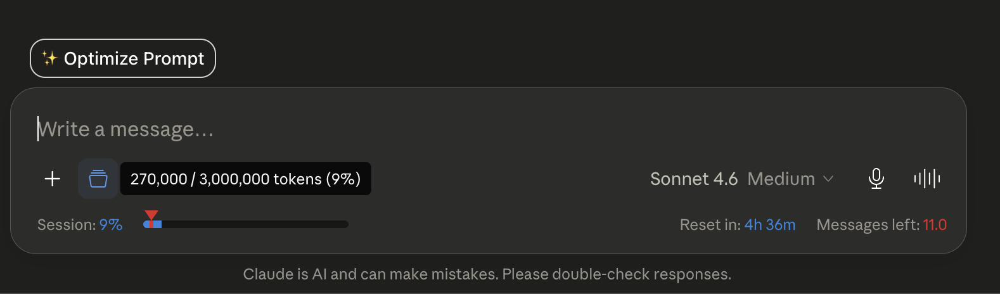

# Day 3 — Role-Based Prompting

## Overview

Today's challenge explored **Role-Based Prompting** — assigning Claude a specific persona before asking a question, so that instead of a generic answer you get a response shaped by a domain expert's priorities and way of thinking.

I tested this by asking the **same question** three ways: once with no role, once as a Startup Founder, and once as a Senior Developer.

## The Question

> Should I build a custom credit risk scoring model or use an existing third-party solution?

## The Prompt

> You have to answer this question in 3 roles.
> **First Role:** There is no role for the first one — just normally whatever you think.
> **Second Role:** Now you are a startup founder, answer the above question according to this persona.
> **Third Role:** This is a Senior Developer role, answer the above question according to this persona.

## The Three Responses (Summarized)

### 🔹 Role 1 — No Role (General Perspective)
Treated it as a balanced "build vs. buy" decision. Laid out clear criteria for *leaning third-party* (early-stage, low volume, limited proprietary data, tight budget, compliance burden) vs. *leaning custom* (unique underserved segments, large proprietary datasets, need for explainability and control, scale economics). Bottom line: start with a third-party solution, validate the market, then add custom modeling as data accumulates.

### 🔸 Role 2 — Startup Founder
Answered through the lens of **time and capital**. Recommended third-party for now, since building from scratch delays product-market fit. Gave a founder's playbook: start with FICO/Experian/Plaid-style APIs to ship fast, collect proprietary data obsessively from day one, negotiate vendor contracts carefully (data ownership, exclusivity), and only revisit building once volume justifies it (~10k+ decisions). Core message: survival comes from shipping and learning fast, not perfecting an unvalidated model.

### 🔧 Role 3 — Senior Developer
Framed it as an **infrastructure and technical-debt** decision. Detailed what building custom really entails (feature pipelines, model lifecycle management, drift detection, explainability layers, MLOps, audit trails). Recommended a **hybrid approach**: use a third-party score as a baseline *feature* rather than the whole model, build a thin wrapper model (logistic regression / XGBoost / LightGBM) enriched with proprietary signals, run shadow scoring in parallel, and gate cutover behind strict metrics (Gini, KS statistic, PSI). Emphasized regulatory defensibility and a safe migration path over a risky cold-turkey switch.

## Key Differences Observed

| Dimension | No Role | Founder | Senior Developer |
|-----------|---------|---------|------------------|
| **Primary lens** | Balanced decision framework | Time, capital, speed to market | Infrastructure & technical debt |
| **Tone** | Neutral, advisory | Decisive, pragmatic | Rigorous, risk-aware |
| **Recommendation** | Start third-party, evolve | Third-party now, build later | Hybrid (baseline + wrapper model) |
| **Focus** | When to choose which | Business survival & PMF | MLOps, validation, migration safety |
| **Detail type** | Criteria checklists | Strategic playbook | Technical architecture & metrics |

## Key Learnings

- The **same question yields meaningfully different advice** depending on the assigned role. Each persona prioritized different risks and surfaced details the others ignored.
- The Founder optimized for **speed and capital efficiency**; the Developer optimized for **technical robustness and regulatory defensibility**. Neither was "wrong" — they reflected different professional incentives.
- Role prompting is powerful for **decision-making**: asking the same question across multiple personas gives you a 360° view before committing, almost like consulting a panel of experts.
- For my own field (credit risk), the Developer's hybrid recommendation was the most actionable — but the Founder's framing was a useful reminder not to over-engineer before validating the business case.

## Tool of the Day — Claude Usage Counter

Installed the **Claude Usage Counter** Chrome extension. It tracks Claude usage, message consumption, and estimated limits in real time directly inside Claude.ai. Useful for staying aware of how much of my quota I'm using during heavy experimentation days like this one.

## What I Worked On

Ran one question across three personas in a single Claude chat, compared how each role reframed the problem, installed and explored the Claude Usage Counter extension, and documented the full experiment here.