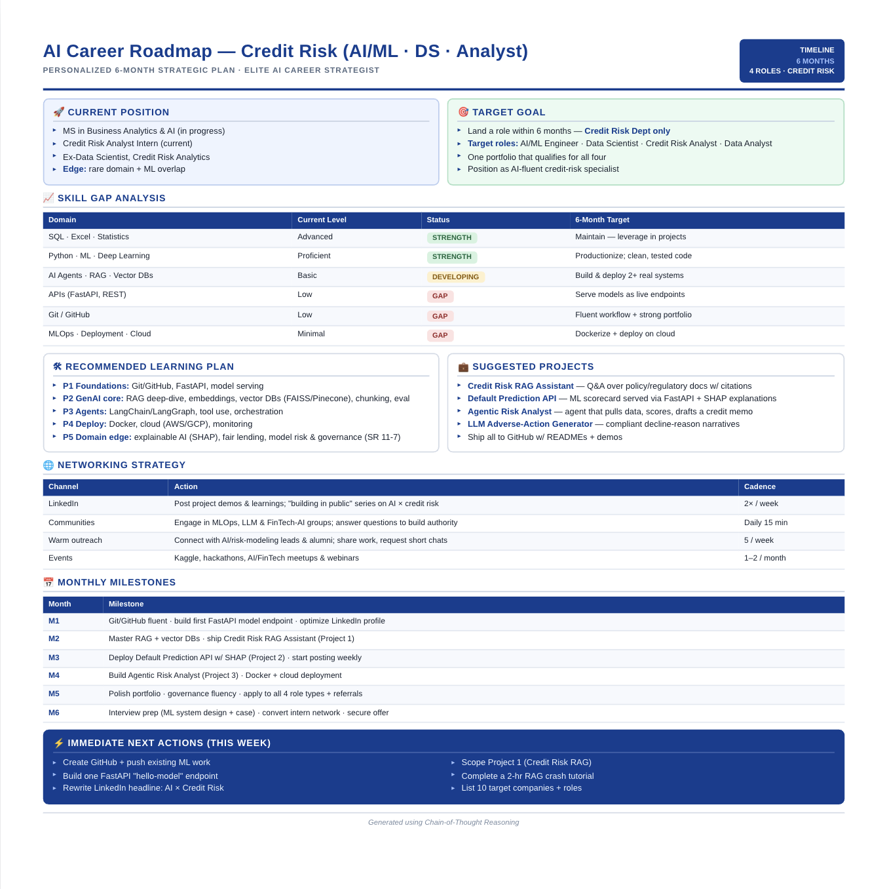

# Day 4 — Chain-of-Thought Prompting

## Overview

Today's challenge explored **Chain-of-Thought (CoT) Prompting** — a technique that forces Claude to reason through a problem step by step before generating a final answer. Instead of jumping straight to a solution, Claude analyzes the situation, identifies gaps, and builds a structured recommendation.

I used this to generate a personalized 6-month AI career roadmap tailored to my background in credit risk and data science.

---

## My 4 Answers to Claude

**Question 1 — Current Situation**
Currently I am pursuing my MS in Business Analytics and AI and also working as a Credit Risk Analyst Intern. Before my Masters I worked as a Data Scientist in the Credit Risk Analytics Department.

**Question 2 — Current Skills**
Very efficient in SQL, Excel, and Statistics. Also know Python, Machine Learning, and Deep Learning. Know the basics of AI Agents, RAG Systems, and Vector Databases. Very limited knowledge of GitHub and APIs.

**Question 3 — Target Goal**
Land a role as an AI/ML Engineer, Credit Risk Analyst, Data Scientist, or Data Analyst — but specifically within the Credit Risk Department only.

**Question 4 — Target Timeline**
Next 6 months.

---

## The Prompt Used

You are an Elite AI Career Strategist. Your goal is to build a personalized roadmap for me. Before creating the roadmap, ask me ONLY these 4 questions about my current situation, current skills, target goal, and target timeline. After collecting all answers, think step by step: analyze my current position, identify strengths, identify skill gaps, identify the fastest path to the goal, recommend learning priorities, recommend projects, recommend networking strategy, and create milestones. Finally generate a visually structured ONE-PAGE roadmap.

---

## Generated Career Roadmap

---

## Roadmap Breakdown

### 🚀 Current Position
- MS in Business Analytics & AI (in progress)
- Credit Risk Analyst Intern (current)
- Ex-Data Scientist, Credit Risk Analytics
- Edge: rare domain + ML overlap

### 🎯 Target Goal
- Land a role within 6 months in Credit Risk only
- Target roles: AI/ML Engineer, Data Scientist, Credit Risk Analyst, Data Analyst
- One portfolio that qualifies for all four
- Position as AI-fluent credit-risk specialist

### 📈 Skill Gap Analysis

| Domain | Current Level | Status | 6-Month Target |
|--------|--------------|--------|----------------|
| SQL, Excel, Statistics | Advanced | STRENGTH | Maintain and leverage in projects |
| Python, ML, Deep Learning | Proficient | STRENGTH | Productionize with clean tested code |
| AI Agents, RAG, Vector DBs | Basic | DEVELOPING | Build and deploy 2+ real systems |
| APIs (FastAPI, REST) | Low | GAP | Serve models as live endpoints |
| Git and GitHub | Low | GAP | Fluent workflow and strong portfolio |
| MLOps, Deployment, Cloud | Minimal | GAP | Dockerize and deploy on cloud |

### 🛠 Recommended Learning Plan
- **P1 Foundations:** Git/GitHub, FastAPI, model serving
- **P2 GenAI Core:** RAG deep-dive, embeddings, vector DBs (FAISS/Pinecone), chunking, eval
- **P3 Agents:** LangChain/LangGraph, tool use, orchestration
- **P4 Deploy:** Docker, cloud (AWS/GCP), monitoring
- **P5 Domain Edge:** Explainable AI (SHAP), fair lending, model risk and governance (SR 11-7)

### 💼 Suggested Projects
- **Credit Risk RAG Assistant** — Q&A over policy/regulatory docs with citations
- **Default Prediction API** — ML scorecard served via FastAPI + SHAP explanations
- **Agentic Risk Analyst** — agent that pulls data, scores, and drafts a credit memo
- **LLM Adverse-Action Generator** — compliant decline-reason narratives
- Ship all to GitHub with READMEs and demos

### 🌐 Networking Strategy

| Channel | Action | Cadence |
|---------|--------|---------|
| LinkedIn | Post project demos and learnings; building in public series on AI x credit risk | 2x per week |
| Communities | Engage in MLOps, LLM and FinTech-AI groups; answer questions to build authority | Daily 15 min |
| Warm Outreach | Connect with AI/risk-modeling leads and alumni; share work, request short chats | 5 per week |
| Events | Kaggle, hackathons, AI/FinTech meetups and webinars | 1-2 per month |

### 📅 Monthly Milestones

| Month | Milestone |
|-------|-----------|
| M1 | Git/GitHub fluent, build first FastAPI model endpoint, optimize LinkedIn profile |
| M2 | Master RAG + vector DBs, ship Credit Risk RAG Assistant (Project 1) |
| M3 | Deploy Default Prediction API w/ SHAP (Project 2), start posting weekly |
| M4 | Build Agentic Risk Analyst (Project 3), Docker + cloud deployment |
| M5 | Polish portfolio, governance fluency, apply to all 4 role types + referrals |
| M6 | Interview prep (ML system design + case), convert intern network, secure offer |

### ⚡ Immediate Next Actions (This Week)
- Create GitHub and push existing ML work
- Build one FastAPI "hello-model" endpoint
- Rewrite LinkedIn headline: AI x Credit Risk
- Scope Project 1 (Credit Risk RAG)
- Complete a 2-hr RAG crash tutorial
- List 10 target companies and roles

---

## Tool of the Day — Capsule Hub

Attempted to install and use **Capsule Hub** — a Chrome extension for organizing prompts, workflows, and reusable AI context in one place. Encountered a server error (HTTP 500) on the provider's end during setup. The extension appears to be experiencing service issues at this time. Will revisit when the service is restored.

---

## Key Learnings

- Chain-of-Thought prompting forces Claude to **show its work** before giving a final answer. The quality of the output is dramatically better than asking the same question without structure.
- The 4-question intake was deceptively simple but gave Claude enough context to produce something genuinely specific and useful — not a generic career guide.
- What surprised me most was how accurately Claude identified my real gaps (APIs, MLOps, cloud deployment) and how the suggested projects were directly tied to closing those gaps in a logical sequence.
- The roadmap is not just a to-do list. It is a structured argument for why certain steps come before others. That is the Chain-of-Thought reasoning working in the background.
- For anyone in analytics or a technical field, CoT prompting is the difference between a generic answer and a strategic plan you can actually act on.

---

## What I Worked On

Used the Elite AI Career Strategist prompt template, answered 4 questions about my current situation and goals, reviewed Claude's step-by-step reasoning process, and generated a personalized 6-month AI career roadmap focused on credit risk and ML engineering roles.

---

*Generated using Chain-of-Thought Reasoning*