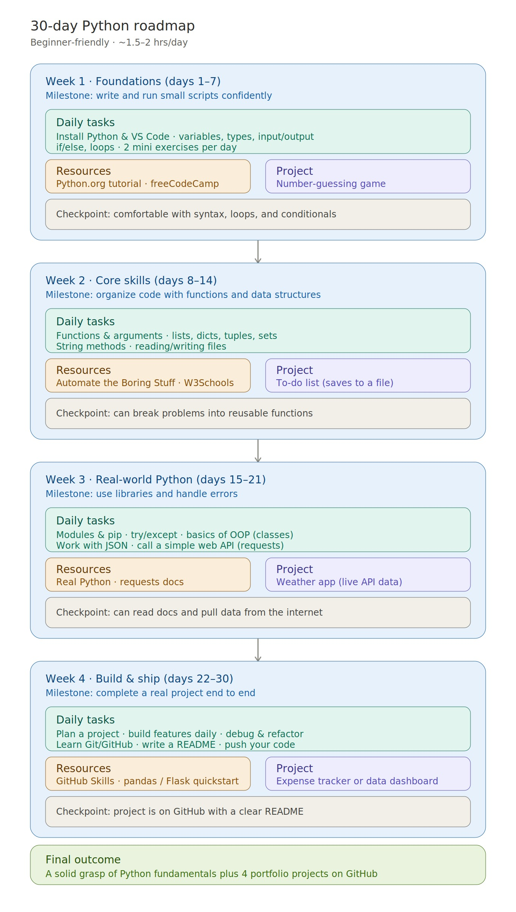
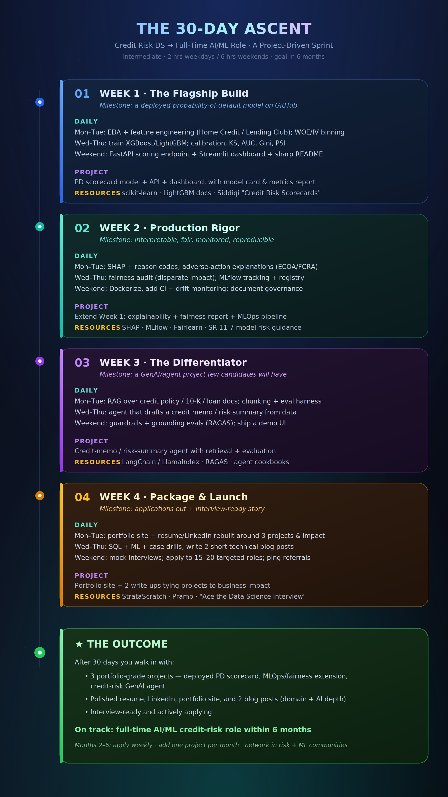
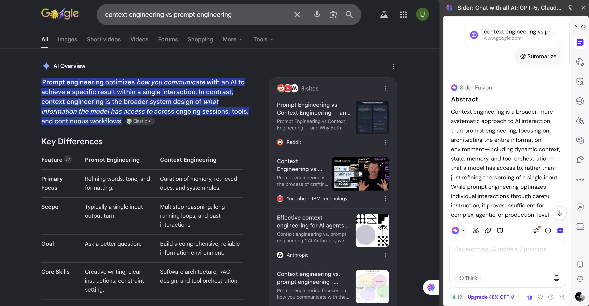

# Day 5 — Context Engineering

## Overview

Today's challenge explored **Context Engineering** — the practice of providing relevant information, constraints, background, goals, and user-specific details to Claude before asking it to perform a task. The key insight is that the quality of context often matters more than the prompt itself.

I tested this by running the same "30-day learning roadmap" request twice — once with zero context, and once with rich personal context — then compared the outputs.

---

## What is Context Engineering?

Context Engineering is broader than prompt engineering. While prompt engineering focuses on refining the words and instructions in a single input, context engineering is about architecting the entire information environment the model has access to — including background, goals, constraints, memory, and domain knowledge.

| Feature | Prompt Engineering | Context Engineering |
|---------|-------------------|---------------------|
| Primary Focus | Refining words, tone, and formatting | Curation of memory, retrieved docs, and system rules |
| Scope | Typically a single input-output turn | Multistep reasoning, long-running loops, past interactions |
| Goal | Ask a better question | Build a comprehensive, reliable information environment |
| Core Skills | Creative writing, clear instructions | Software architecture, RAG design, tool orchestration |

---

## Prompt A — Without Context

**The Prompt:**

Create a 30-day learning roadmap. Include weekly milestones, daily tasks, resources, projects, and a final outcome. Make it practical and beginner-friendly.

**Output:**

**Summary of Output:**
Claude generated a generic **30-day Python roadmap** for a complete beginner. The four weeks covered Python basics, core skills, real-world Python, and a final build-and-ship week. Projects included a number-guessing game, a to-do list, a weather app, and an expense tracker. Resources were Python.org, freeCodeCamp, and W3Schools.

Useful for someone starting from zero. Completely irrelevant to my actual situation.

---

## Prompt B — With Context

**The Prompt:**

Create a 30-day learning roadmap.

Context:
- Current Situation: MS Student + Credit Risk Analyst Intern
- Current Skills: Python, SQL, ML, LLM, Deep Learning, Basic RAG and AI Agents, Advanced Credit Risk Knowledge
- Goal: Land a full-time AI/ML, Data Scientist, or Data Analyst role in Credit Risk within 6 months
- Available Time: 2 hours per day on weekdays and 6 hours per day on weekends
- Experience Level: Intermediate (2+ years as a Data Scientist in Credit Risk Analytics and now a Credit Risk Analyst Intern)
- Preferred Learning Style: Projects

Include weekly milestones, daily tasks, resources, projects, and a final outcome. Make it practical and beginner-friendly.

**Output:**

**Summary of Output:**
Claude generated **"The 30-Day Ascent"** — a fully personalized sprint from Credit Risk DS to full-time AI/ML role.

| Week | Title | Milestone | Key Project |
|------|-------|-----------|-------------|
| Week 1 | The Flagship Build | Deployed probability-of-default model on GitHub | PD scorecard model + FastAPI + Streamlit dashboard |
| Week 2 | Production Rigor | Interpretable, fair, monitored, reproducible | Explainability + fairness report + MLOps pipeline |
| Week 3 | The Differentiator | A GenAI/agent project few candidates will have | Credit-memo / risk-summary agent with RAG + eval |
| Week 4 | Package and Launch | Applications out + interview-ready story | Portfolio site + 2 write-ups tied to business impact |

**Final Outcome:** 3 portfolio-grade projects, polished resume and LinkedIn, interview-ready and actively applying — on track for a full-time AI/ML credit-risk role within 6 months.

---

## Comparison

| Dimension | Prompt A (No Context) | Prompt B (With Context) |
|-----------|----------------------|------------------------|
| Topic | Generic Python for beginners | Credit Risk AI/ML career sprint |
| Assumed level | Complete beginner | Intermediate with 2+ years experience |
| Projects | Number-guessing game, weather app | PD scorecard API, RAG agent, MLOps pipeline |
| Tools mentioned | Python.org, freeCodeCamp | SHAP, MLflow, LangChain, RAGAS, FastAPI |
| Relevance to my goals | None | Directly mapped to my 6-month target |
| Would I follow it? | No | Yes, starting tomorrow |

**Answers to the comparison questions:**
1. **Which roadmap feels more personalized?** Prompt B by a wide margin. It knew my domain, my level, my timeline, and my learning style.
2. **Which roadmap would I actually follow?** Prompt B. Prompt A assumed I don't know what a variable is.
3. **What role did context play?** Context transformed a generic template into a strategic, actionable plan. Without it, Claude had to make assumptions — and every assumption it made was wrong for my situation.

---

## Tool of the Day — Sider AI

**Sider AI** is a browser extension that provides access to multiple AI models, writing assistance, summarization, translation, and productivity features directly inside the browser.

I used Sider AI to search and summarize **"context engineering vs prompt engineering"** directly inside Google Chrome. The Sider Fusion panel generated an instant abstract explaining the key difference: prompt engineering optimizes individual interactions while context engineering architects the entire information environment a model has access to — including dynamic context, state, memory, and tool orchestration.

---

## Key Learnings

- Context is not just helpful — it is the difference between a generic output and a genuinely useful one. The prompt was almost identical in both cases. The context did all the work.
- Claude makes assumptions when context is missing. Every assumption it made in Prompt A was wrong for my situation — wrong skill level, wrong topic, wrong tools, wrong projects.
- Providing specific details (experience level, available time, preferred learning style, domain) does not just personalize the tone. It fundamentally changes the reasoning path Claude takes.
- Context Engineering is what separates casual AI use from professional AI use. Modern AI agents rely on it heavily — through memory systems, RAG pipelines, and retrieved documents — for exactly this reason.
- Sider AI is a practical tool for bringing AI summarization directly into your browsing workflow without switching tabs.

---

## What I Worked On

Ran two versions of the same prompt in separate Claude chats, compared the outputs side by side, installed and explored Sider AI's summarization feature on a live Google search, and documented the full experiment here.

---

*Generated using Context Engineering principles*