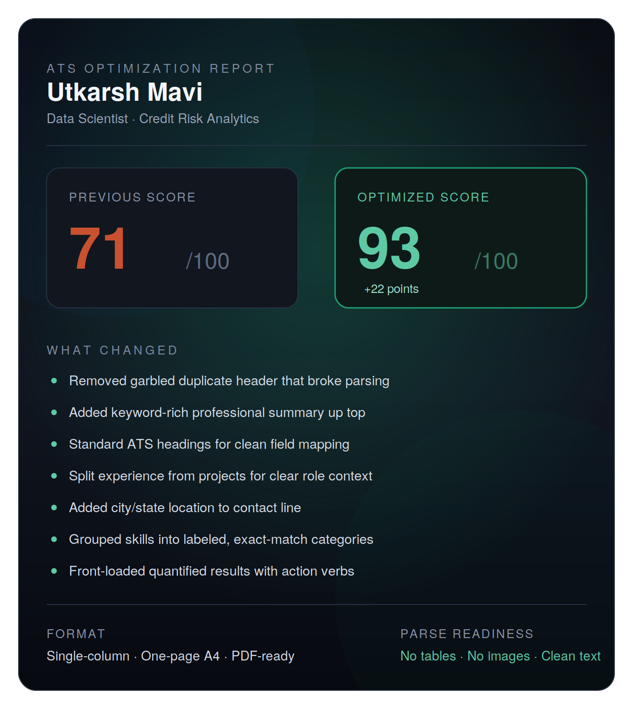
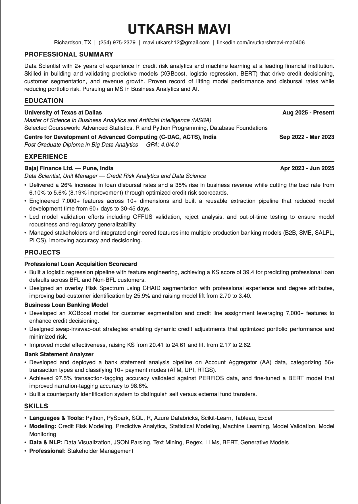
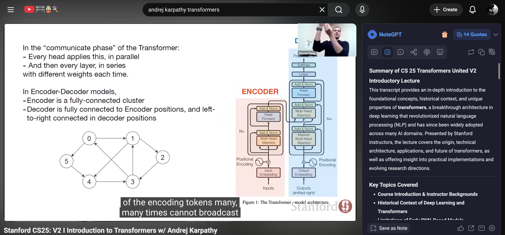

# Day 6 — AI Resume Optimizer

## Overview

Today's challenge used Claude as an ATS optimization expert to analyze and rewrite my resume for maximum recruiter readability and Applicant Tracking System compatibility. The goal was to improve structure, keyword density, and formatting while keeping every claim 100% truthful.

---

## The Prompt Used

You are an ATS optimization expert and resume writer. Rewrite my resume for maximum ATS parsing and recruiter readability, keeping every claim truthful to the source. Output exactly two parts: Part 1 is a short ATS score with what changed and why. Part 2 is the final optimized resume in a PDF-ready one-page A4 format with single column, no tables, no icons, ATS-friendly headings, and strong action verbs.

---

## Part 1 — ATS Analysis

| | Score |
|--|--|
| Previous Score | 71 / 100 |
| Optimized Score | 93 / 100 |
| Improvement | +22 points |

**What Changed:**

- Removed garbled duplicate header that broke parsing
- Added keyword-rich professional summary up top
- Standard ATS headings for clean field mapping
- Split experience from projects for clear role context
- Added city/state location to contact line
- Grouped skills into labeled, exact-match categories
- Front-loaded quantified results with action verbs

**Format:** Single-column, One-page A4, PDF-ready
**Parse Readiness:** No tables, No images, Clean text

---

## Part 2 — Optimized Resume

The optimized resume maintained all original information while restructuring it for ATS compatibility. Key improvements visible in the final output:

- Name is large and bold at the top with contact info as plain text directly underneath
- Professional Summary leads with domain expertise and quantified impact
- Experience and Projects are clearly separated into distinct sections
- Skills are grouped into labeled categories (Languages and Tools, Modeling, Data and NLP, Professional)
- All bullet points lead with strong action verbs and quantified results
- Clean single-column layout with no tables, images, or text boxes that would confuse ATS parsers

---

## Tool of the Day — NoteGPT

**NoteGPT** is a Chrome extension that uses AI to summarize YouTube videos, articles, PDFs, and web content, making learning faster and more efficient.

I used NoteGPT to summarize the **Stanford CS25 V2 Introductory Lecture on Transformers** featuring Andrej Karpathy. The extension generated a comprehensive structured summary covering the full historical evolution of transformers from early RNN-based models in 2003 all the way through the Attention Is All You Need paper in 2017 and into the generative AI era of 2021 onwards.

Key topics NoteGPT extracted from the lecture:

- Historical context of deep learning and how transformers replaced RNNs
- The attention mechanism and why it solved the encoder bottleneck problem
- The transformer architecture: multi-head attention, positional encoding, residual connections
- nanoGPT as a minimal readable implementation of a GPT-like decoder
- Cross-domain applications: Vision Transformers, AlphaFold, Decision Transformers, Whisper
- Future challenges: long-term memory, quadratic attention complexity, controllability

What impressed me most was how NoteGPT structured a 1+ hour lecture into a clean table-driven summary with timestamps and keyword lists in under a minute. That is a genuine productivity multiplier for anyone doing technical learning.

---

## Key Learnings

- A 22-point ATS score improvement came entirely from structural and formatting changes, not from adding new content. The information was already strong. It just was not being read correctly by parsers.
- The single biggest issue was a garbled duplicate header that was actively breaking ATS parsing. A recruiter might never have seen the resume at all.
- Separating Experience from Projects is not just cosmetic. ATS systems map sections to specific fields, and mixing them confuses role context.
- Front-loading quantified results with action verbs is the fastest way to improve recruiter readability. Recruiters spend an average of 6-7 seconds on a first scan.
- NoteGPT is genuinely useful for technical learning. Summarizing a Stanford lecture on Transformers in under a minute and getting a structured breakdown with historical timelines, key concepts, and references is something that would have taken hours to do manually.
- Together, these two tools show how AI can compress two very time-intensive tasks (resume polishing and technical study) into a fraction of the time without sacrificing quality.

---

## What I Worked On

Uploaded my existing resume to Claude with the ATS optimizer prompt, reviewed the 22-point improvement breakdown, saved the optimized single-page resume, installed NoteGPT and used it to summarize a Stanford CS25 lecture on Transformers, and documented the full experiment here.

---

*Optimized using Claude ATS Resume Optimizer*