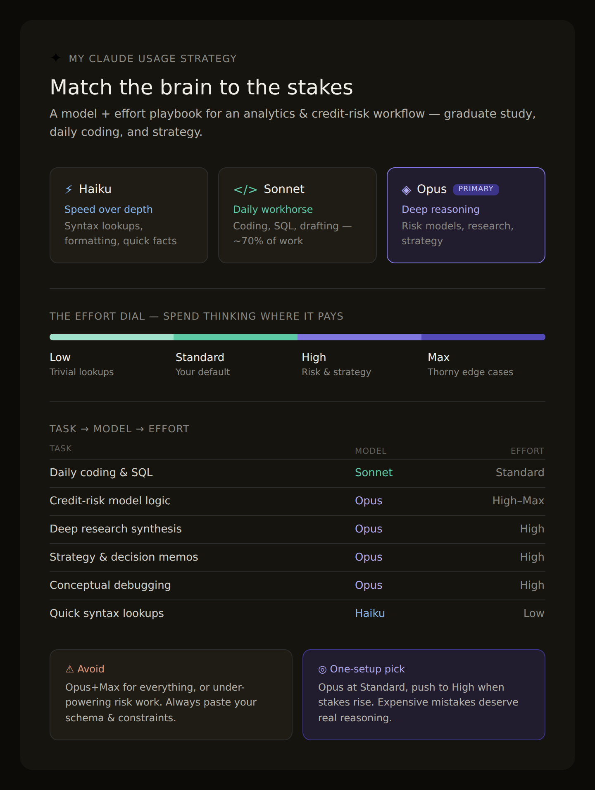
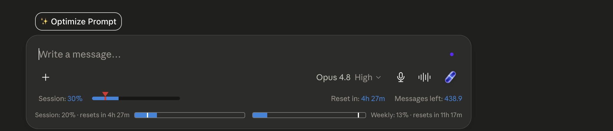

# Day 7 — Claude Model Selection & Reasoning Effort

## Overview

Today's challenge was about working smarter with Claude, not just harder. Instead of using the same model for every task, I learned how to match the right Claude model and reasoning effort level to the right type of work. The result was a personalized Claude usage strategy built specifically around my profile as a graduate analytics student, credit risk professional, and heavy daily Claude user.

---

## My 4 Answers to Claude

**Question 1 — Current Situation:**
Student + Professional (MS in Business Analytics and AI + Credit Risk Analyst Intern)

**Question 2 — Primary Activities:**
Coding, Research, Learning, Career Preparation, Business Planning, Credit Risk Modeling

**Question 3 — How Often I Use Claude:**
Heavy User — daily across multiple task types

**Question 4 — Type of Outputs Needed:**
Deep Research, Coding Help, Learning Support, Business Strategy

---

## The Prompt Used

You are a Claude AI Expert, Productivity Consultant, and AI Workflow Architect. Your goal is to recommend the best Claude model and effort settings for me based on my profile and daily tasks. Ask me 4 questions about my current situation, primary activities, how often I use Claude, and what type of outputs I need most. Then think step by step to analyze my profile, identify which model fits me best, when to use Haiku, Sonnet, and Opus, which effort setting I should use most often, and generate a personalized Claude workflow table.

---

## Generated Claude Usage Strategy

---

## Strategy Breakdown

### Recommended Primary Model

**Claude Opus 4.8** — with Sonnet 4.6 as the daily workhorse for routine coding and quick tasks.

My profile sits at the intersection of three demanding domains: technical depth (coding, data science, credit risk modeling), analytical reasoning (research, strategy), and judgment under nuance (business and career decisions). Opus is built for exactly this — multi-step reasoning, long-context analysis, and synthesis across complex inputs.

---

### When to Use Each Model

| Model | Best For | Why |
|-------|----------|-----|
| **Haiku** | Quick syntax lookups, reformatting, simple regex, fast definitional questions, summarizing short text | Speed over depth. Do not waste a heavyweight model on throwaway tasks |
| **Sonnet 4.6** | Day-to-day coding, SQL, debugging, drafting docs, study summaries, data cleaning scripts | Handles around 70% of daily work at the right balance of speed and quality |
| **Opus 4.8** | Credit risk model design, deep research synthesis, strategy frameworks, hard conceptual debugging, career strategy, high-stakes writing | When a subtle error is expensive, you need real reasoning |

---

### Recommended Effort Levels

| Effort | When to Use |
|--------|-------------|
| **Low** | Simple coding, lookups, formatting, quick factual answers |
| **Standard** | Default for most daily work — routine coding, drafting, first-pass research |
| **High** | Credit risk modeling logic, multi-source research synthesis, strategy documents, anything where a wrong answer has real consequences |
| **Max** | Reserve for the genuinely thorny — validating risk model assumptions, untangling conceptual bugs, major strategic decisions. Use sparingly |

---

### My Personalized Claude Workflow

| Task | Best Model | Best Effort | Reason |
|------|-----------|-------------|--------|
| Quick syntax / lookups | Haiku | Low | Speed matters, depth does not |
| Daily coding and SQL | Sonnet 4.6 | Standard | Strong coding, fast turnaround |
| Debugging (syntactic) | Sonnet 4.6 | Standard | Fast pattern recognition |
| Debugging (conceptual) | Opus 4.8 | High | Needs real reasoning |
| Data cleaning scripts | Sonnet 4.6 | Standard | Routine, well-defined |
| Credit risk model logic | Opus 4.8 | High to Max | High stakes, subtle errors costly |
| Deep research synthesis | Opus 4.8 | High | Multi-source reasoning |
| Strategy / decision memos | Opus 4.8 | High | Framing and trade-offs |
| Study summaries | Sonnet 4.6 | Standard | Volume work, good enough |
| Career / high-stakes writing | Opus 4.8 | High | Judgment and nuance |

---

### Biggest Mistakes to Avoid

- Using Opus + Max for everything. Match the tool to the stakes, not to anxiety.
- Using a light model for risk modeling. A subtle logical error in credit risk work is expensive.
- Not giving context. Domain-heavy work requires pasting the data schema, model spec, and constraints.
- One giant prompt for complex tasks. Break big strategy and modeling work into stages.
- Trusting statistical output without checking. Use Claude as a reasoning partner, not an oracle.

---

### Final Recommendation

If using only ONE model and ONE effort level: **Claude Opus 4.8 at Standard effort, pushing to High when stakes rise.**

My work skews analytical and consequential — credit risk, strategy, graduate analytics. The cost of an under-powered answer outweighs the convenience of a faster light model. Opus at Standard gives serious reasoning by default without always paying the Max tax.

---

## Tool of the Day — Claude Counter

**Claude Counter** (v0.4.2) is a browser extension that shows token count, cache timer, and native session/weekly usage bars directly on Claude.ai.

Successfully installed Claude Counter alongside Claude Usage Tracker (v5.2.8) and Capsule Hub (v2.10). Having real-time visibility into token consumption and session limits directly inside Claude.ai helps make smarter decisions about when to use heavier models like Opus versus lighter ones like Sonnet or Haiku — which ties directly into today's core lesson about matching effort to the task.

---

## Key Learnings

- Not all Claude models are created equal and using the wrong one is a real cost — either in quality (under-powering a high-stakes task) or in efficiency (over-powering a trivial one).
- The mental model "match the brain to the stakes" is the clearest way to think about model selection. Haiku for speed, Sonnet for volume, Opus for consequence.
- Effort levels are just as important as model selection. Standard covers most daily work. High is for anything where being wrong is expensive. Max is a scalpel, not a default.
- For credit risk and analytical work specifically, under-powering is the dangerous mistake. A subtle logical error in a risk model costs far more than the time saved by using a lighter model.
- Real-time usage tracking via Claude Counter makes it practical to stay aware of consumption patterns and adjust model choices accordingly throughout the day.

---

## What I Worked On

Answered 4 profile questions, generated a personalized Claude model and effort strategy, reviewed the task-by-model workflow table, installed and verified Claude Counter in the browser, and documented the full strategy here.

---

*Generated using Claude Model Selection and Reasoning Effort principles*