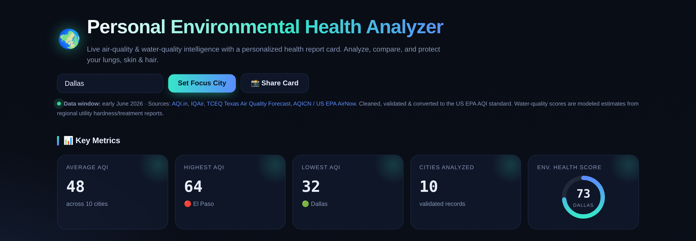
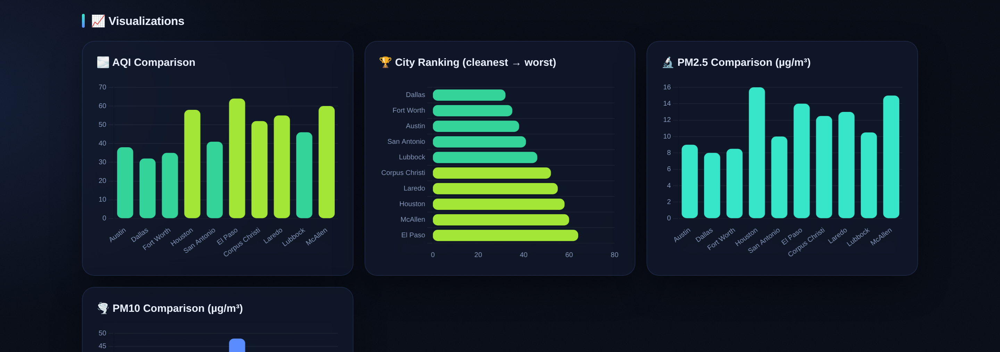
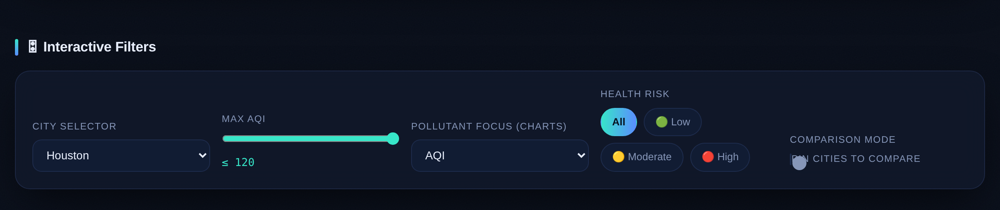
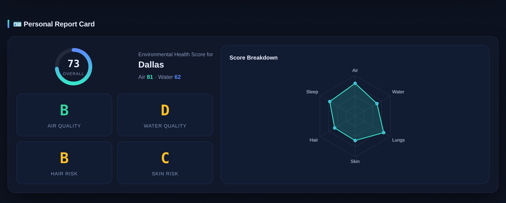
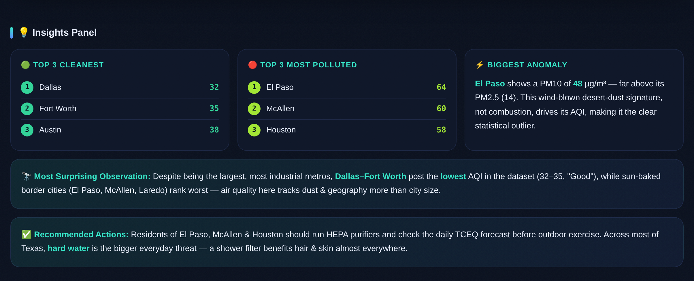

# Day 8 — Build Your First AI-Powered Dashboard

**Challenge:** Turn Claude into an application builder. Instead of producing text, Claude generates a fully interactive, downloadable HTML application — charts, filters, report cards, and all.

**Deliverable:** A complete `index.html` application: the **Personal Environmental Health Analyzer**, a dark-theme dashboard analyzing air and water quality across 10 Texas metros, with a personalized environmental health score.

---

## What I Built

I used a single structured prompt — assigning Claude four roles at once (Senior Data Analyst, Environmental Researcher, UX Designer, and Frontend Dashboard Developer) — to generate a self-contained dashboard application. No code snippets, no copy-pasting fragments together. One prompt, one working product that runs locally by opening `index.html`.

The app cleans and validates AQI/EPA data for 10 Texas cities (Austin, Dallas, Fort Worth, Houston, San Antonio, El Paso, Corpus Christi, Laredo, Lubbock, McAllen), normalizes everything to the US EPA AQI standard, imputes missing pollutant values, then drives a fully interactive interface off that cleaned dataset.

---

## The Dashboard

### Overview & Key Metrics
The hero section with live key metrics — average AQI, highest and lowest AQI cities, cities analyzed, and the overall Environmental Health Score ring.

### Visualizations
AQI comparison, city ranking (cleanest to worst), and pollutant comparison charts — all rendered with Chart.js and color-coded by AQI category.

### Interactive Filters
City selector, max-AQI range slider, pollutant focus, health-risk chips, and a city-comparison toggle. Here the dashboard is filtered to Houston.

### Personal Report Card
An Environmental Health Score (0–100) with A–F grades for Air Quality, Water Quality, Hair Risk, and Skin Risk, plus a radar chart breaking down the score across six dimensions.

### Insights Panel
Top 3 cleanest and most polluted cities, the biggest statistical anomaly, the most surprising observation, and recommended actions.

---

## Key Findings From the Analysis

- **Cleanest:** Dallas (AQI 32), Fort Worth (35), Austin (38) — the largest metros posted the *best* air quality.
- **Most polluted:** El Paso (64), McAllen (60), Houston (58) — sun-baked border cities ranked worst.
- **Biggest anomaly:** El Paso shows a PM10 of 48 µg/m³, far above its PM2.5 of 14. That gap is a wind-blown desert-dust signature, not combustion — it's the dust, not the cars, driving the AQI.
- **Most surprising:** Air quality in Texas tracks dust and geography more than city size or industry. The big industrial metros are the clean ones.
- **The real everyday threat:** Not the air — the water. Nearly every Texas metro runs on hard to very-hard water, making mineral buildup the most consistent daily risk to hair and skin. A simple shower filter helps almost everywhere.

---

## Key Learnings

**1. Artifacts turn Claude from an answer engine into a product builder.** The same model that writes a paragraph can ship a working application. The difference is entirely in how you frame the request — "build me a tool," not "tell me about a tool."

**2. Multi-role prompting raises the quality ceiling.** Asking Claude to act as analyst, researcher, designer, and developer simultaneously forced it to reconcile competing concerns — data rigor, visual polish, and usability — in one output. The result was more complete than any single-role prompt would produce.

**3. Specifying the deliverable format matters as much as the content.** The instruction "do not provide code snippets — generate a complete, downloadable, responsive HTML application ready to save as index.html" is what produced a real product instead of scattered code blocks. Being explicit about the *artifact* changed the entire output.

**4. The hardest part was invisible.** The data cleaning, validation, imputation of missing values, and normalization to a single AQI standard all happen silently before a single chart draws. A good dashboard is only as trustworthy as the pipeline feeding it — and that pipeline lives in the parts no one sees.

---

## Files in This Folder

- `index.html` — the complete, downloadable dashboard application (open it locally to interact with live charts and filters)
- `dashboard-overview.png` — header and key metrics
- `dashboard-charts.png` — visualizations
- `filters.png` — interactive filters (Houston selected)
- `report-card.png` — personal report card with grades and radar
- `insights.png` — insights panel
- `dashboard-full.png` — full-page capture of the entire dashboard
- `city-cards.png` — city detail cards
