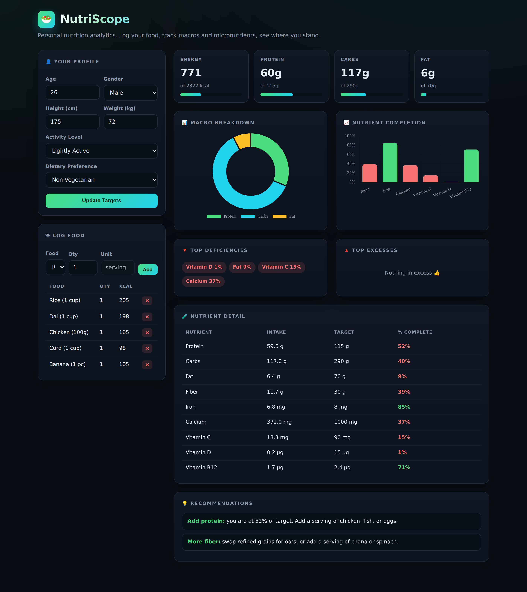
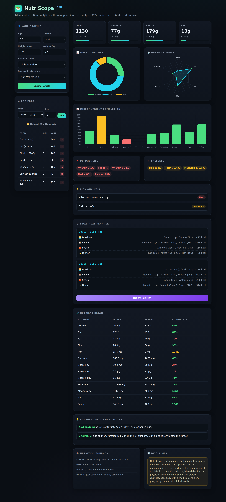
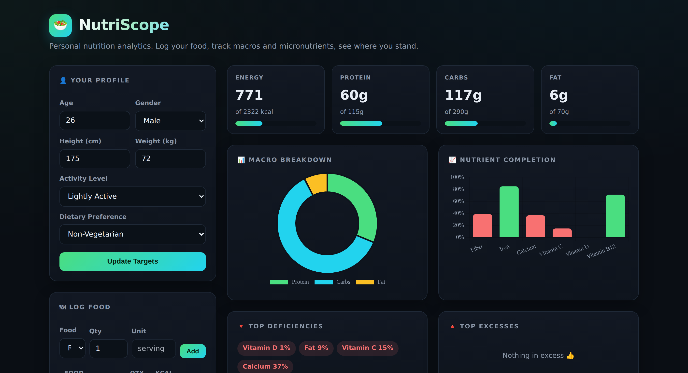
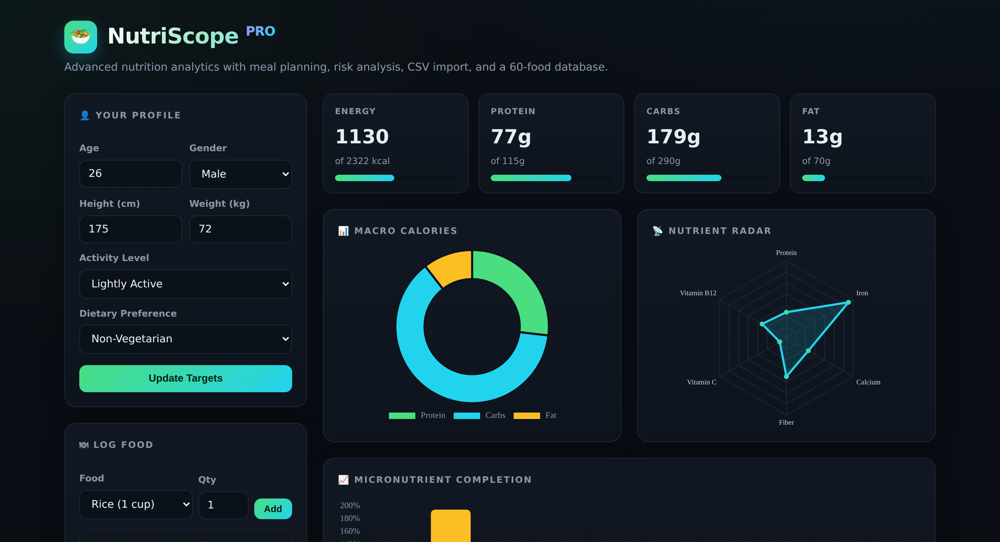

# Day 9 — Build & Enhance an AI Nutrition Analytics App

**Challenge:** Learn iterative AI application development. Instead of asking Claude to build one massive application in a single prompt, build a working MVP first, then progressively enhance it. This is how experienced AI builders actually work — it improves reliability, quality, and output consistency.

**Deliverable:** Two versions of **NutriScope**, a single-file nutrition analytics app — the MVP and the enhanced build — plus a comparison of the two.

---

## The Approach: MVP First, Then Enhance

The core lesson of Day 9 is restraint. The instinct is to describe the entire dream application in one giant prompt and hope Claude nails it. In practice, that produces bloated, fragile, inconsistent output. The professional pattern is two-phase:

1. **Prompt 1** builds a focused MVP that works end to end.
2. **Prompt 2** layers new capability onto that working foundation.

Each phase is small enough for the model to execute reliably, and the second prompt has a solid base to build on instead of inventing everything at once.

---

## Version 1 — The MVP

Built from a single prompt. NutriScope MVP is a complete, working nutrition tracker with:

- **Profile inputs:** age, gender, height, weight, activity level, dietary preference
- **Food logging:** add food, set quantity, editable table, remove entries
- **20-food database:** common Indian and Western staples with full nutrient profiles
- **Tracking:** calories, protein, carbs, fat, fiber, iron, calcium, vitamin C, vitamin D, B12
- **Calculations:** energy needs (Mifflin-St Jeor BMR x activity), macro and micronutrient targets, percentage completion
- **Dashboard:** energy progress, macro doughnut chart, nutrient-completion bars, top deficiencies, top excesses, full nutrient table
- **Recommendations:** food additions and swaps based on dietary preference
- **Design:** dark-theme premium SaaS UI, mobile responsive, Chart.js, single HTML file, no backend

---

## Version 2 — The Enhanced Build

The second prompt enhanced the existing app without rebuilding it. Everything from the MVP stayed intact, and on top of it came:

- **CSV upload** — bulk-import a food log from a `food,qty` file
- **40 more foods** — database expanded from 20 to **60 items** (quinoa, tofu, salmon, soya chunks, seeds, nuts, more)
- **Additional micronutrients** — added potassium, magnesium, zinc, and folate (9 nutrients to 13)
- **2-day meal planner** — auto-generates breakfast, lunch, snack, and dinner per day with calorie counts, adapted to dietary preference
- **Risk analysis** — flags anemia, low bone-mineral intake, B12/D insufficiency, fiber gaps, caloric surplus/deficit with High/Moderate severity tags
- **Educational disclaimer** — clear "not medical advice" guidance
- **Nutrition sources** — ICMR-NIN, USDA FoodData Central, WHO/FAO references cited
- **Better charts** — added a nutrient radar chart alongside the macro doughnut and an expanded micronutrient bar chart
- **Advanced recommendations** — context-aware swaps (e.g. pair iron sources with vitamin C, B12 watch for vegetarians)

---

## Side-by-Side Comparison

| | MVP (Prompt 1) | Enhanced (Prompt 2) |
|---|---|---|
| Food database | 20 foods | 60 foods |
| Nutrients tracked | 9 | 13 |
| Charts | 2 (doughnut, bar) | 3 (doughnut, radar, bar) |
| Data input | Manual only | Manual + CSV upload |
| Meal planning | None | 2-day auto planner |
| Risk analysis | None | Severity-tagged risk panel |
| Recommendations | Basic add/swap | Context-aware advanced logic |
| Sources & disclaimer | None | Cited sources + medical disclaimer |

**MVP top section:**

**Enhanced top section:**

---

## Key Learnings

**1. Building in phases beats building all at once.** The MVP gave Claude a stable, working foundation. The enhancement prompt only had to reason about what to add, not how to rebuild the entire thing. The result was more reliable than a single mega-prompt would have produced, because each step kept the model's attention focused.

**2. An MVP forces you to define what "working" actually means.** Writing Prompt 1 made me decide the minimum viable feature set — profile, logging, tracking, dashboard. That clarity is what made the enhancement prompt easy to write. You cannot enhance something you have not yet defined.

**3. Enhancements compound on structure, not chaos.** Because the MVP already had a clean data model (one food dictionary, one totals function, one render loop), adding 40 foods and 4 nutrients was a matter of extending existing structures, not rewiring the app. Good MVP architecture is what makes iteration cheap.

**4. This mirrors how real software ships.** No competent team builds the full product in one release. They ship a core, learn, and iterate. Day 9 is that same discipline applied to building with AI — and it produces noticeably better results than trying to one-shot the whole thing.

---

## Files in This Folder

- `nutriscope-mvp.html` — Version 1, the MVP (open locally to use)
- `nutriscope-enhanced.html` — Version 2, the enhanced build (open locally to use)
- `mvp-full.png` — full view of the MVP
- `enhanced-full.png` — full view of the enhanced version
- `mvp-top.png` — MVP top section (for comparison)
- `enhanced-top.png` — enhanced top section (for comparison)
