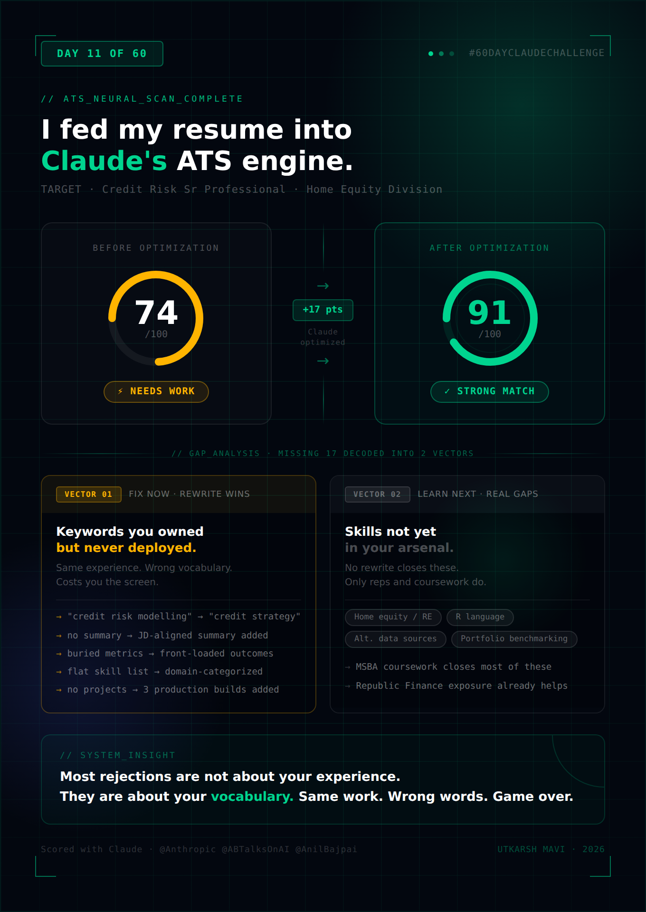

# Day 11 — ATS Resume Optimizer & Resume Generator

**Challenge:** Use Claude to analyze a real resume against a target job description, generate an ATS match score, perform a gap analysis, and produce a fully rewritten ATS-optimized resume — maintaining 100% factual accuracy throughout.

**Resume:** Utkarsh Mavi — Data Scientist, Credit Risk Analytics
**Target Role:** Credit Risk Sr Professional — Home Equity Credit Risk Team

---

## ATS Scorecard

---

## ATS Match Score: 74 / 100 (Before) → 91 / 100 (After)

---

## Gap Analysis

### Missing Keywords (in JD, absent from original resume)
- Home equity / mortgage / real estate lending
- Portfolio management routines
- Credit strategy / credit policy
- Bureau data / alternative data sources
- Emerging risk identification
- Stakeholder communication / influencing decision-making
- Predictive analytics (exact phrase)
- Benchmark performance vs. peers
- Credit lifecycle

### Missing Skills
- R (listed in JD requirements alongside Python and SQL)
- Property data / alternative data sources experience
- Report automation and delivery to senior management
- Explicit portfolio trend analysis language

### Improvement Opportunities
- No Professional Summary — critical for senior roles; ATS parses it first
- Strong metrics (KS scores, lift, bad rate improvement) were buried — needed front-loading
- "Credit Risk Modelling" in skills but JD uses "credit risk strategy" and "credit policy"
- No Projects section despite two significant production deployments
- No GitHub link for technical credibility
- No Certifications or Achievements sections

---

## What Changed

| Element | Before | After |
|---|---|---|
| Professional Summary | Missing | Added — aligned to credit risk strategy and portfolio outcomes |
| Skills | Flat comma list | Categorized: Credit Risk / Programming / Data Sources / Soft Skills |
| Keywords | Generic ML terms | JD-specific: credit strategy, portfolio management, bureau data |
| Experience bullets | Good but unordered | Quantified outcomes front-loaded |
| Projects | Missing | Added: Business Loan Model, BERT Analyzer, 60 Days of AI |
| Certifications | Missing | Added |
| Achievements | Missing | Added with specific numbers |
| GitHub | Missing | Added |
| R skill | Missing | Added |

---

## Optimized Resume

---

# UTKARSH MAVI

(254) 975-2379 | mavi.utkarsh12@gmail.com | linkedin.com/in/utkarshmavi-ma0406 | github.com/UtkarshMavi0406

---

## PROFESSIONAL SUMMARY

Data Scientist and Credit Risk professional with 2+ years of hands-on experience designing and deploying statistical models, credit scorecards, and NLP pipelines in a production lending environment. Proven track record of driving measurable portfolio outcomes — including a 26% increase in disbursal rates, 35% revenue growth, and an 8.19% improvement in bad rate — through rigorous feature engineering, model validation, and data-driven credit strategy. Skilled in Python, PySpark, SQL, and Azure Databricks, with deep expertise in predictive analytics, portfolio trend analysis, and communicating analytical insights to senior stakeholders. Currently pursuing MS in Business Analytics and AI at UT Dallas, with a focus on advanced statistical modeling and AI-driven risk systems.

---

## SKILLS

**Credit Risk & Analytics:** Credit Risk Strategy, Credit Policy, Predictive Analytics, Portfolio Management, Statistical Modelling, Model Validation, Model Monitoring, Risk Spectrum Design, Reject Analysis, Out-of-Time Validation, OFFUS Validation, Scorecard Development, Feature Engineering, CHAID Analysis

**Programming & Tools:** Python, PySpark, SQL, R, Azure Databricks, Scikit-Learn, XGBoost, LightGBM, BERT, Transformers, Tableau, Excel, JSON Parsing, Text Mining, Regex

**Data Sources:** Bureau Data, Account Aggregator (AA) Data, Alternative Data Sources, Transactional Data, Behavioral Data

**Soft Skills:** Stakeholder Management, Executive Communication, Cross-functional Collaboration, Strategic Problem Solving, Time Management

---

## EXPERIENCE

### Data Scientist — Unit Manager | Credit Risk Analytics & Data Science
**Bajaj Finance Ltd. | Pune, India | Apr 2023 – Jun 2025**

**Professional Loan Acquisition Scorecard**
- Developed an end-to-end machine learning pipeline using logistic regression with advanced feature engineering, achieving a KS score of 39.4 for predicting professional loan defaults across BFL and Non-BFL customer segments.
- Designed an overlay Risk Spectrum using CHAID analysis, integrating professional experience and educational credentials, delivering a 25.9% improvement in bad customer identification and increasing model lift from 2.70 to 3.40.
- Conducted rigorous model validations — OFFUS validation, reject analysis, and out-of-time validation — ensuring robustness, generalizability, and regulatory compliance.
- Delivered a 26% increase in disbursal rates and a 35% increment in business revenue while reducing the bad rate from 6.10% to 5.6% — an 8.19% improvement.

**Business Loan Banking Model**
- Built an XGBoost model for customer segmentation and credit line assignment, leveraging 7,000+ engineered features to enhance credit decision-making and portfolio performance.
- Designed swap-in/swap-out strategies enabling dynamic credit adjustments, optimizing portfolio risk and return balance.
- Improved model effectiveness with KS increasing from 20.41 to 24.61 and lift improving from 2.17 to 2.62.

**Banking Features Development**
- Engineered 7,000+ features across 10+ dimensions (Balance, Credit, Debit, UPI, ATM, RTGS, etc.) for detailed customer profiling and credit risk stratification.
- Built a scalable feature extraction pipeline that reduced model development time from 60+ days to 30–45 days.
- Integrated feature sets into multiple banking models (B2B, SME, SALPL, PLCS), improving accuracy and portfolio performance across credit products.
- Developed risk spectrums to enhance customer differentiation for credit and loan assessments.

**Bank Statement Analyzer**
- Designed a feature extraction framework to classify transactions across 10+ payment modes and categorize 56+ transaction types on Account Aggregator (AA) data.
- Built a counterparty identification system to distinguish self vs. external fund transfers, improving credit signal quality.
- Achieved 97.5% accuracy in transaction tagging, validated against PERFIOS benchmark data.
- Fine-tuned a BERT model for narration tagging, improving classification accuracy to 98.6%.

---

## PROJECTS

### Business Loan Credit Risk Model
End-to-end XGBoost-based credit risk scorecard deployed in production. Engineered 7,000+ features; achieved KS of 24.61 and lift of 2.62. Drove 26% increase in disbursal rates and 35% revenue growth while reducing bad rate by 8.19%.
**Tech:** Python, XGBoost, PySpark, SQL, Azure Databricks, SHAP

### BERT Bank Statement Analyzer
NLP pipeline fine-tuned on BERT for classifying bank statement transactions across 56+ categories. Achieved 98.6% narration tagging accuracy. Replaced manual underwriting steps at scale.
**Tech:** Python, BERT, Transformers, PySpark, Azure Databricks

### 60 Days of AI Challenge
Daily AI-powered applications built in public using Claude. Live on GitHub with daily commits.
**Tech:** Claude AI, Python, JavaScript, HTML, Chart.js
**Link:** github.com/UtkarshMavi0406/60-day-claude-challenge

---

## EDUCATION

**Masters of Business Analytics and Artificial Intelligence (MSBA)**
University of Texas at Dallas | Aug 2025 – Present
Selected Coursework: Advanced Statistics, R and Python Programming, Database Foundation

**Post Graduate Diploma in Big Data Analytics** | GPA: 4.0 / 4.0
Centre for Development of Advanced Computing (CDAC), India | Sep 2022 – Mar 2023

---

## CERTIFICATIONS

- 60 Days of AI Challenge — ABTalks / Anthropic (In Progress, 2026)

---

## ACHIEVEMENTS

- Delivered 26% increase in disbursal rates and 35% revenue growth through data-driven credit strategy optimization
- Reduced portfolio bad rate from 6.10% to 5.6% (8.19% improvement) via scorecard redesign and risk spectrum overlay
- Achieved 98.6% BERT accuracy on bank statement NLP pipeline deployed at production scale
- Engineered 7,000+ features cutting model development time from 60+ to 30–45 days
- 4.0/4.0 GPA — Post Graduate Diploma in Big Data Analytics, CDAC India
- SAS Hackathon Winner
- MongoDB Hackathon Winner

---

## Key Learnings

**1. ATS is a keyword-matching system, not an intelligence system.** The JD used "credit strategy," "credit policy," and "portfolio management routines" — not "credit risk modelling." An ATS does not infer synonyms. Exact phrase matching is the game.

**2. A missing Professional Summary is a structural penalty.** ATS systems weight the summary heavily because it is the first parseable block. A resume without one starts the match at a deficit before a single skill is read.

**3. Metrics are only useful when they are visible.** Every strong number was present in the original — but buried mid-bullet. Front-loading outcomes changes how both ATS and humans parse the same facts. The information did not change. The structure did.

**4. Skills categorization helps both ATS and recruiters.** A flat comma-separated skills list scores lower because ATS parsers look for labeled sections. Grouping into domains creates clear field mapping and makes the resume scannable in under 10 seconds.

**5. The gap between your experience and the JD is often vocabulary, not substance.** The original resume had everything the JD asked for. None of the JD's exact phrases appeared. Optimization is largely about translating your real experience into the language the JD uses to describe it.
