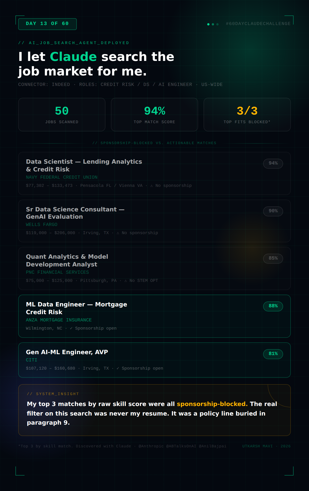

# Day 13 — Build Your AI Job Search Assistant

**Challenge:** Connect Indeed to Claude and let it discover, score, and analyze real job opportunities based on a professional profile and search criteria — then surface skill gaps and market insights.

**Profile:** Utkarsh Mavi — Data Scientist, Credit Risk Analytics, 2+ years production ML, MS Business Analytics & AI @ UT Dallas
**Target Titles:** Credit Risk Professional · Data Scientist (Credit Risk) · Data Analyst (Credit Risk) · AI Engineer
**Search Criteria:** Anywhere in US · Salary negotiable · Posted within last 7 days (where available) · Exclude contract roles and roles with no visa sponsorship

---

## Job Search Results Card

---

## Top Opportunities Discovered

| Company | Role | Location | Posted | Match Score | CTC | Apply Link |
|---|---|---|---|---|---|---|
| Anza Mortgage Insurance Corp | ML Data Engineer — Mortgage Credit Risk | Wilmington, NC | Apr 9, 2026 | 88% | Not listed | [Apply](https://to.indeed.com/aaqtjk4kjgvb) |
| Citi | Gen AI-ML Engineer, AVP | Irving, TX | Apr 3, 2026 | 81% | $107,120–$160,680 | [Apply](https://to.indeed.com/aartwrs7wywq) |
| PenFed Credit Union | Sr Data Scientist, NPV Modeling | McLean, VA (Hybrid) | May 28, 2026 | 76% | $106,950–$156,683 | [Apply](https://to.indeed.com/aajjwhsd7mf9) |

### Why Each Fits

**Anza Mortgage Insurance — ML Data Engineer, Mortgage Credit Risk (88%)**
Near-perfect domain overlap. Mortgage credit risk plus document processing automation using AI/ML mirrors the Bank Statement Analyzer project — extracting structured signals from unstructured documents. Built on Databricks, which transfers directly from Azure Databricks experience. Python and SQL required. 0–2 years experience requirement matches current level precisely. No sponsorship restriction listed.

**Citi — Gen AI-ML Engineer, AVP (81%)**
This is the "AI Engineer" title targeted, at a major bank. Heavy focus on RAG pipelines, LLM evaluation, and prompt engineering — directly maps to BERT fine-tuning and the 60 Days of AI work. The listed 5+ years requirement is a stretch against 2+ years actual experience, but a dual ML+NLP production background and applied AI portfolio could offset that on paper. No sponsorship restriction listed.

**PenFed Credit Union — Sr Data Scientist, NPV Modeling (76%)**
Direct credit risk modeling role — NPV calculators for auto, personal loan, and credit card portfolios feeding into credit decisioning and loss forecasting. Logistic regression, ML, SQL, Python, R all match the existing stack. Requires a Master's (in progress) and 3 years experience (2+ years held, close). No sponsorship restriction listed. Hybrid in McLean, VA.

---

## Excluded — Otherwise Strong Matches (Sponsorship Blocked)

These three scored highest on raw skill match across the entire search, but explicitly state no visa sponsorship or no STEM OPT participation, which was specified as an exclusion criterion:

| Company | Role | Location | Match Score | CTC | Exclusion Reason |
|---|---|---|---|---|---|
| Navy Federal Credit Union | Data Scientist (Lending Analytics & Credit Risk) | Pensacola, FL / Vienna, VA | 94% | $77,302–$133,473 | "Does not provide sponsorship... must be authorized to work without current or future sponsorship" |
| Wells Fargo | Sr Data Science Consultant — GenAI Evaluation (ERA) | Irving, TX | 90% | $119,000–$206,000 | "This position is NOT eligible for Visa sponsorship" |
| PNC Financial | Quant Analytics & Model Development Analyst | Pittsburgh, PA | 85% | $75,000–$125,000 | "PNC will not provide sponsorship for employment visas or participate in STEM OPT" |

---

## Most Commonly Required Skills Across All Jobs

Python, SQL, Machine Learning / Statistical Modeling, Credit Risk Modeling (PD/LGD/EAD or NPV), R, Databricks/Cloud platforms (AWS/Azure), Model Validation & Governance, Communication to senior stakeholders/governance committees, and — increasingly — Generative AI / LLM evaluation experience appearing even in traditional credit risk postings.

---

## Skill Gap Analysis

**Current Strengths (directly matched):** Python, SQL, PySpark, XGBoost/LightGBM, BERT/NLP, Azure Databricks, credit risk modeling (PD scorecards), model validation (OOT, reject analysis), SHAP explainability.

**Missing/Underrepresented:**
- **R** — appears in nearly every credit risk JD (Navy Federal, PenFed) alongside Python/SQL
- **AWS** — Azure dominant in current background; Anza and Citi both list AWS
- **LLM evaluation frameworks** (LLM-as-judge, hallucination detection, RAG with LangChain/LlamaIndex) — Citi-level GenAI roles expect this explicitly
- **CECL/CCAR/loss forecasting frameworks** — PNC and PenFed both reference this; adjacent to existing KS/lift work but not identical
- **US-specific credit products** — mortgage NPV, auto/personal loan portfolio specifics

---

## Market Demand Insights

The market is splitting credit risk data science into two tracks: traditional quantitative modeling (PD/LGD/NPV, model governance, Python/SQL/R) and applied GenAI (RAG, LLM evaluation, prompt engineering, increasingly embedded inside risk and compliance functions at major banks like Wells Fargo and Citi). A profile combining production ML with BERT/NLP and applied AI sits exactly at the seam between these two tracks — a narrowing but high-value niche.

The most consistent blocker discovered was not skill fit. It was visa sponsorship. Among the highest-scoring matches by skill alignment, the top 3 were all sponsorship-restricted. This is the single biggest filter on this search — more than title, location, or even salary.

---

## Recommendations to Improve Interview Chances

1. **Lead with the Anza and Citi roles** — both are sponsorship-open and high-fit; tailor the resume's "Projects" section to mirror their exact language (document processing automation, RAG pipelines, LLM evaluation).
2. **Add R visibly to the skill set** — even a small project. It appears in nearly every credit risk JD and is currently absent from the resume.
3. **Get AWS Cloud Practitioner certified** — closes the Azure-to-AWS gap that shows up at Anza, Citi, and others.
4. **Build a small RAG/LLM evaluation project** — directly targets the Citi Gen AI-ML Engineer role and the broader GenAI-in-risk trend at Wells Fargo, Citi, and similar banks.
5. **Target companies with established international hiring pipelines** — fintechs (like Anza) and global banks (Citi, Barclays, Goldman Sachs) historically sponsor more readily than US-domestic credit unions (Navy Federal, PenFed, PNC).

---

## Overall Fit Assessment

For Credit Risk / Data Scientist roles, the profile is a strong technical match (76–94% across postings) — the gap is almost entirely sponsorship policy, not skills. For AI Engineer roles, the profile is credible but junior (81% at Citi despite a 5-year requirement gap); the applied AI portfolio (60 Days of AI, BERT) is what closes that gap on paper. Compensation targets ($100K–$160K range seen across fits) are realistic and achievable given the production track record. The Anza and Citi roles represent the best near-term targets — both fit the skill profile and carry no sponsorship restrictions.

---

## Key Learnings

**1. The connector turns Claude from an advisor into an active searcher.** Instead of asking "what should I look for," Claude went and looked — searching live Indeed listings, pulling full job descriptions, and scoring fit against a real profile. That is a qualitatively different kind of help than résumé advice.

**2. Match score and "can I actually take this job" are two different questions.** The highest-scoring roles by skill alignment (94%, 90%, 85%) were all completely closed off by a single sentence about visa sponsorship — usually buried near the bottom of the posting. A skills-only search would have surfaced these as top recommendations and wasted hours of application effort.

**3. Reading the fine print early saves the most time.** Sponsorship language, security clearance requirements (the Elder Research/IRS role required a Public Trust clearance), and "in-office only" policies are filters that matter as much as the job title — and they are usually buried two-thirds of the way down the posting.

**4. The market is telling a story if you read across postings.** Seeing GenAI/LLM evaluation language show up inside traditional bank risk and compliance roles (Wells Fargo ERA, Citi) signals where the field is heading — even roles that look like "credit risk" on the surface increasingly want applied AI skills underneath.

**5. AI-powered search still needs a human filter.** The tool surfaced 50 jobs across multiple searches; most were irrelevant noise (research scientist roles, NASA postings, healthcare analyst roles) despite reasonable search terms. The value was in combining broad search with targeted re-querying and then applying judgment — not in one perfect query.
