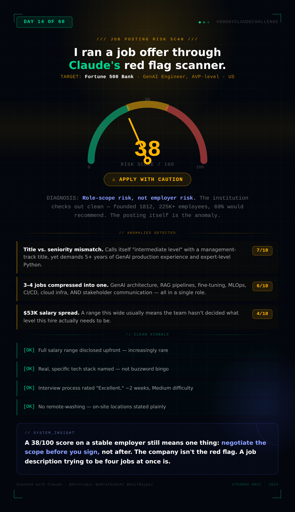

# Day 14 — AI Job Red Flag Detector

**Challenge:** Use Claude to analyze a real job posting and company information for hidden risks, unrealistic requirements, toxic culture signals, misleading remote claims, and hiring/company red flags — before investing time in an application.

**Job Analyzed:** GenAI Engineer, AVP-level — Fortune 500 Bank (US)
*(Discovered on Day 13 via the Indeed connector job search)*

---

## Risk Scorecard

---

## Overall Risk Score: 38 / 100

*(Lower = lower risk. This is a moderate-low risk posting with a few notable inconsistencies.)*

---

## Top Red Flags

| Red Flag | Severity (1–10) |
|---|---|
| Title-experience mismatch: "AVP" and "intermediate level" applied to a role requiring 5+ years of AI/ML development with expert-level Python, deep transformer/LLM architecture knowledge, MLOps, and Agentic AI experience | 7 |
| Enormous skill surface area: the role spans GenAI architecture, RAG pipeline engineering, fine-tuning, MLOps, containerization, CI/CD, cloud infra (AWS/Azure/GCP), chatbot design, AND stakeholder communication — effectively 3-4 distinct job functions compressed into one posting | 6 |
| Vague seniority signal: "intermediate level position" directly contradicts the AVP banking title (AVP at most banks implies 5-8+ years and people-management adjacent scope) | 5 |
| Wide salary band ($107K–$160K, a $53K spread) suggests the role could be filled at very different experience levels — a sign the team may not have a clear leveling decision yet | 4 |
| "Stay up-to-date with the latest advancements in GenAI research" combined with production deployment responsibilities signals a small team expected to do both R&D and shipping — common burnout pattern | 4 |

---

## Positive Signals

- **Salary transparency** — full range disclosed upfront ($107,120–$160,680), which is increasingly rare and a strong positive signal of process maturity
- **Specific, real technology stack** — LlamaIndex, LangChain, vector databases (Pinecone, Weaviate, Chroma, Faiss), MLflow, Docker/Kubernetes — this reads like a team that actually uses these tools, not buzzword-bingo
- **Company stability** — Founded 1812, 200M+ customer accounts, $10B+ revenue, 225,000+ employees. About as stable as a financial employer gets
- **Decent employee sentiment** — 69% of reviewers would recommend this employer to a friend (7,452 yes / 3,315 no), 61% salary satisfaction
- **Reasonable interview process** — rated "EXCELLENT" experience, "MEDIUM" difficulty, roughly 2-week process — not an endless multi-month gauntlet
- **No remote-washing** — the posting is upfront that this is on-site across specific locations, with no misleading "remote" framing
- **Clear EEO and accommodation language**, standard for a large regulated bank

---

## Risk Breakdown

| Category | Risk Level |
|---|---|
| Requirements | Medium-High |
| Culture | Medium |
| Remote | Low |
| Hiring | Low-Medium |
| Company | Low |

---

## Final Verdict

### ⚠️ Apply with Caution

This is not a scam posting or a toxic-culture red-flag-fest — This is a stable, well-reviewed employer with a transparent salary range and a real, specific tech stack. The risk here is **role-scoping risk, not employer risk**: the posting reads like a wishlist assembled by combining a Senior GenAI Engineer role and an MLOps role into one AVP slot, with a seniority signal ("intermediate") that contradicts both the title and the requirements. Apply, but go in expecting to negotiate scope and level clarity during the interview process — and don't be surprised if the actual day-to-day ends up narrower than the posting implies (a common pattern when postings are this broad).

---

## 5 Smart Interview Questions

**1. "The posting describes this as an 'intermediate level' role with an AVP title, but the requirements list 5+ years of AI/ML development including production GenAI systems. Can you help me understand where this role actually sits on the team's leveling framework, and what a typical career path looks like from here?"**
*Validates: title-experience mismatch, leveling clarity*

**2. "This role spans GenAI architecture, RAG pipeline development, MLOps/deployment, and ongoing research into emerging techniques like Agentic AI. Realistically, how is time split across these areas day to day, and is there a dedicated MLOps or platform team this role collaborates with?"**
*Validates: unrealistic scope, whether one person is expected to do 3-4 jobs*

**3. "Given the salary range spans $107K to $160K, what factors typically determine where a new hire lands within that range — is it primarily years of experience, technical assessment performance, or something else?"**
*Validates: hiring process transparency, whether the range reflects genuine flexibility or unclear leveling*

**4. "How does the team currently handle staying current with fast-moving GenAI research while also meeting production deployment timelines? Is there dedicated time for experimentation, or does that happen alongside delivery work?"**
*Validates: burnout risk — R&D + shipping expectations*

**5. "What does the model evaluation and governance process look like for GenAI outputs at this institution, given the regulatory environment? How much of this role's work goes through formal model risk review versus more exploratory work?"**
*Validates: realistic understanding of how much "Agentic AI" exploration actually translates to shipped work in a regulated bank — and surfaces whether the role is more exploratory or more production-focused*

---

## Key Learnings

**1. Risk and employer quality are two different axes.** This posting scored a moderate risk (38/100) despite the employer being a genuinely stable, well-regarded institution with good salary transparency. The risk wasn't "should I work here" — it was "is this specific job description an honest description of one job." Conflating the two leads candidates to either over-trust a bad posting from a good company, or skip a good opportunity because of a poorly written JD.

**2. Title-seniority contradictions are a real signal worth probing.** "AVP" plus "intermediate level" plus "5+ years required" is not a typo — it usually means the hiring team hasn't finished deciding what they're actually hiring for. That ambiguity transfers directly to the candidate as scope creep risk after the offer.

**3. A wide salary band is information, not just a range.** A $53K spread on a single posting often means the role could be filled at multiple levels, and where you land may depend more on negotiation than on a fixed leveling decision. That is useful to know before the comp conversation, not during it.

**4. The best defense against a bad-fit role is asking about scope before accepting, not after.** All five interview questions generated here are designed to surface exactly the ambiguity flagged in the risk analysis — turning red flags into specific, professional questions that a strong candidate would ask anyway.

**5. "Apply with Caution" is itself useful information.** Not every red flag means walk away. A 38/100 score with strong positive signals (salary transparency, real tech stack, stable employer) means: this is worth pursuing, but go in with your eyes open about what to clarify. The value of the tool isn't a binary green light or red light — it's knowing exactly what to ask.
