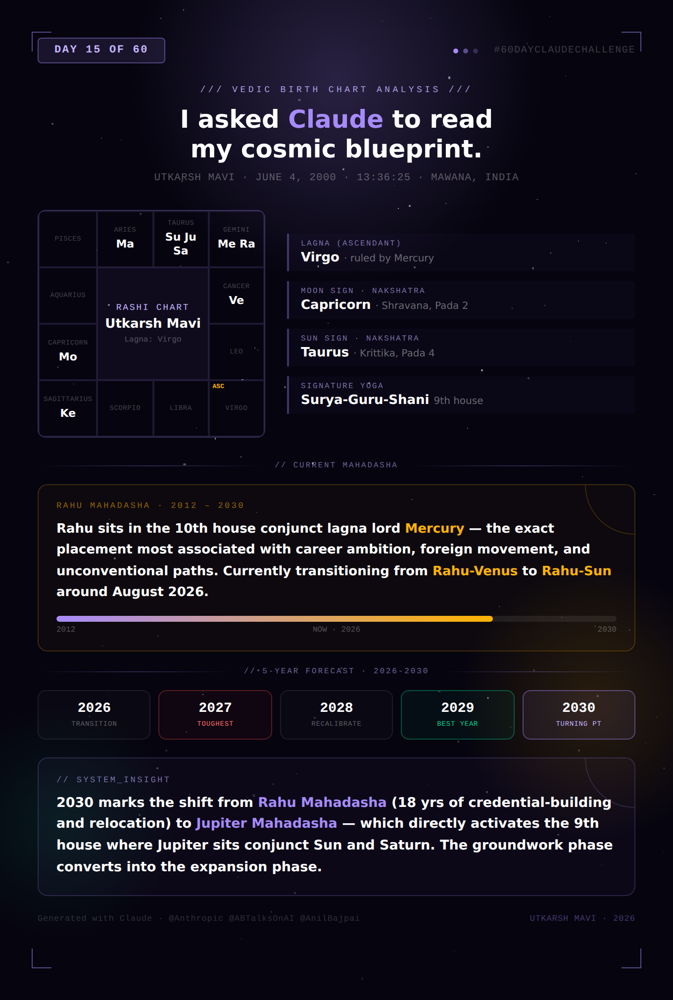

# Day 15 — Build a Personal Life Analysis Consultant

**Challenge:** Learn structured report generation with Claude. Provide structured personal inputs and let Claude generate a comprehensive, multi-section report combining analysis, forecasting, and recommendations — following the Parashara/Jaimini Vedic astrology framework as a structured-report exercise.

**A note on framing:** Vedic astrology is a traditional belief system, not an empirically validated framework. This exercise is included as a prompt-engineering and structured-report-generation challenge — the value is in observing how Claude transforms structured inputs into a layered, multi-section report with internal consistency, not in treating the forecasts as predictions to plan around.

**Inputs Provided:**
- Full Name: Utkarsh Mavi
- Gender: Male
- Date of Birth: June 4, 2000
- Birth Time: 13:36:25 (Exact)
- Place of Birth: Mawana, Meerut, Uttar Pradesh, India
- Current City: Richardson, Texas, USA
- Relationship Status: Unmarried
- Profession: Credit Risk Analyst (formerly Data Scientist, Credit Risk Analytics)
- Top 3 Concerns: Future Career, Health, Wealth

---

## Generated Report Card

---

## 1. Birth Chart Summary

| Element | Value |
|---|---|
| Lagna (Ascendant) | Virgo (Kanya) — ruled by Mercury |
| Moon Sign (Rashi) | Capricorn (Makara) |
| Sun Sign | Taurus (Vrishabha) |
| Nakshatra & Pada (Moon) | Shravana, Pada 2 |
| Nakshatra (Sun) | Krittika, Pada 4 |

### Planetary Placements

| Planet | Sign | House (from Virgo Asc) | Notes |
|---|---|---|---|
| Sun | Taurus | 9th | Conjunct Jupiter & Saturn |
| Moon | Capricorn | 5th | Shravana Nakshatra |
| Mars | Aries | 8th | |
| Mercury (Lagna Lord) | Gemini | 10th | Own sign, conjunct Rahu |
| Jupiter | Taurus | 9th | Conjunct Sun & Saturn |
| Venus | Cancer | 11th | House of gains |
| Saturn | Taurus | 9th | Conjunct Sun & Jupiter |
| Rahu | Gemini | 10th | Conjunct Mercury |
| Ketu | Sagittarius | 4th | |

### Major Yoga: Surya-Guru-Shani Conjunction (9th House, Taurus)

A rare triple conjunction of Sun, Jupiter, and Saturn in the house of fortune, higher learning, and long journeys — the single most defining feature of the chart. Reading: significant opportunity arrives, but typically later and through sustained effort rather than early luck.

### Major Combination: Rahu-Mercury Conjunction (10th House, Gemini)

Rahu amplifies whatever it touches. Paired with the lagna lord in the career house, this reads as intensified drive toward unconventional, technology-driven, or foreign-linked career paths.

### Functional Benefic / Malefic Summary

| Category | Planets |
|---|---|
| Functional Benefics | Mercury (Lagna Lord), Venus (2nd & 9th Lord — Dhana Yoga) |
| Moderate Benefic | Jupiter (4th & 7th Lord) |
| Functional Malefics | Mars (3rd & 8th Lord), Sun (12th Lord) |
| Neutral/Mixed | Saturn (5th & 6th Lord) |

---

## 2. Life Pattern Analysis

**Core personality:** Virgo Lagna with well-placed Mercury produces an analytical, detail-oriented, methodical core — processing the world through structure and precision. Capricorn Moon adds seriousness and long-term thinking; Shravana Nakshatra (a "lifelong student" star) reinforces continuous learning.

**Childhood and family influences:** Ketu in the 4th house often indicates detachment, change, or early independence from "the expected path."

**Repeating karmic patterns:** The Rahu-Mercury 10th house conjunction suggests ambition consistently pointing outward — toward bigger institutions, foreign environments, and unconventional career routes.

**Relationship tendencies:** Venus in the 11th house suggests relationships growing out of shared goals and social/professional circles — partnerships that double as alliances.

**Career strengths and blind spots:** Strength is Mercury-Rahu-10th house — built for analytical, data-heavy, cross-border careers. Blind spot is the Surya-Guru-Shani conjunction in the 9th — a tendency toward over-preparation or over-credentialing before taking a leap.

**Financial habits:** Venus's dual rulership of 2nd and 9th, placed in the 11th (gains), points to methodical accumulation through career income and networks rather than windfalls.

---

## 3. Career & Wealth (Highest Priority)

**Career suitability:** Strongly favors analytical, quantitative, technology-adjacent careers — data science, risk analytics, financial modeling — combining Mercury's precision with Rahu's pull toward emerging domains.

**Job vs. Business:** 10th house strength (Mercury + Rahu) favors high-responsibility roles within established institutions over early independent ventures. Entrepreneurship is more likely post-2030, after the Jupiter Mahadasha begins.

**Leadership potential:** Sun (9th house, conjunct Jupiter) suggests leadership developing through expertise and credibility — strengthening with age and tenure.

**Government job potential:** Saturn + Sun (12th lord, government significator) in the 9th house suggests affinity for regulated, large-institution environments — banking and finance fit this signature well.

**Foreign opportunities:** One of the strongest signals in the chart. 9th house (3 planets including Sun/Jupiter), 10th house Rahu, and 4th house Ketu (detachment from origin) together describe the relocation from India to the US for career and education — already in motion.

**Wealth accumulation potential:** Strong and steady, via Venus (2nd & 9th lord) in the 11th house of gains.

**Investments/property:** Ketu in the 4th suggests non-traditional property patterns — property acquired abroad rather than inherited.

### Age Ranges

| Phase | Age Range | Astrological Basis |
|---|---|---|
| Career breakthroughs | 26–30 (2026–2030) | Rahu Mahadasha antardashas of Sun and Moon |
| Major career turning point | ~30 (2030) | Jupiter Mahadasha begins — activates 9th house trine |
| Wealth growth period | 30–38 (2030–2038) | Jupiter Mahadasha, Venus well-disposed |
| Challenging phase | 27 (2027) | Rahu-Sun Antardasha — transitional friction |

---

## 4. Relationships & Marriage

**Love vs. arranged:** Venus (11th house) plus 7th house ruled by Jupiter (sitting in 9th with Saturn) suggests a hybrid "love-cum-arranged" pattern — relationships beginning in social/professional contexts but carrying arranged-marriage-level structure and seriousness.

**Marriage timing window:** Rahu-Moon Antardasha (2028–2029) favors relationship deepening; window extends into early Jupiter Mahadasha. **Primary window: 2029–2032.**

**Spouse characteristics:** 7th lord Jupiter conjunct Sun and Saturn in the 9th suggests a partner connected to education or travel/foreign background, with a mature, responsibility-oriented temperament.

**Strengths and risks:** Strength is intellectual/goal alignment (Mercury-Venus connection). Risk is Mars as 8th lord in the 8th house — occasional intensity or sudden disagreements, best managed through clear communication.

---

## 5. Current Dasha Analysis

**Vimshottari sequence** (from Moon's nakshatra, Shravana, ruled by Moon): Moon → Mars → Rahu → Jupiter → Saturn → Mercury → Ketu → Venus → Sun.

| Dasha Period | Approximate Span |
|---|---|
| Moon Mahadasha | Birth – ~2005 |
| Mars Mahadasha | ~2005 – 2012 |
| **Rahu Mahadasha** | **~2012 – 2030** |
| Jupiter Mahadasha | ~2030 – 2046 |

### Current Mahadasha: Rahu (2012–2030)

A defining period — Rahu sits in the 10th house conjunct lagna lord Mercury, activating the exact placement most associated with career ambition, foreign movement, and unconventional paths. The US relocation for graduate study and the pivot toward AI/credit risk analytics fall squarely within this Mahadasha.

### Current Antardasha: Venus → transitioning to Sun (~August 2026)

**Current opportunities (Rahu-Venus, through mid-2026):** Venus governs networks and social capital — favorable for building visibility through public work (e.g., this 60-day challenge).

**Upcoming themes (Rahu-Sun, from ~Aug 2026):** Sun as 12th lord is associated with transitions — job changes, visa/immigration milestones, or institutional shifts (e.g., MS program completion, internship-to-full-time transition).

---

## 6. 5-Year Forecast (2026–2030)

| Year | Career | Money | Relationships | Health |
|---|---|---|---|---|
| 2026 | Rahu-Venus → Rahu-Sun transition (Aug). Networking peaks early; institutional transition begins later | Stable, gains from professional visibility | Social/professional circle expands | Moderate — manage year-end transition stress |
| 2027 | Rahu-Sun (full year). Job/status transition likely | Transitional expenses; stabilizes by year-end | Steady; less relationship focus | Watch stress-related issues |
| 2028 | Rahu-Sun ends → Rahu-Moon begins. Emotional recalibration | Fluctuation early, improving | Significant — relationship deepening begins | Improving |
| 2029 | Rahu-Moon (full year). Stable professional growth | Improving steadily | **Strong — primary marriage-consideration window** | Good |
| 2030 | Rahu-Mars (brief) → **Jupiter Mahadasha begins (~Sept/Oct)**. Major turning point | Short-term volatility, then long-term growth begins | Marriage window extends into Jupiter dasha | Caution around accidents/overexertion (Mars, brief) |

**Best year: 2029** — most balanced combination of career stability, improving finances, and strongest relationship indicators.

**Toughest year: 2027** — Rahu-Sun's transitional nature likely correlates with major life-stage transitions (graduation, employment shift).

**Major turning point: 2030** — Shift from Rahu Mahadasha (credential-building, relocation) to Jupiter Mahadasha (expansion, authority) — directly activating the 9th house trine.

---

## 7. Remedies

No acute doshas identified requiring urgent intervention. Supportive practices offered:

**Mantras:** Gayatri Mantra (daily) — harmonizes Sun-Jupiter energies. Rahu Beej Mantra (Saturdays) — traditionally recommended during Rahu Mahadasha.

**Donations:** Yellow items (Thursdays, aligned with Jupiter, supportive of the upcoming Mahadasha shift). Black sesame/mustard oil (Saturdays, Saturn).

**Spiritual practices:** Meditation, particularly during dasha transition windows (Aug 2026, early 2028, Sept/Oct 2030).

**Gemstones:** Not strongly indicated — no affliction pattern that traditionally calls for gemstone remedies.

---

## Key Learnings

**1. Structured inputs produce structured, internally consistent outputs.** Providing all ten required data points upfront (name, exact birth time, location, profession, concerns) let Claude build a report where every section referenced and built on the others — the career section connected back to specific planetary placements established in section 1, and the dasha analysis connected forward to the forecast. Missing even one input (especially exact birth time) would have broken this chain, since the entire house system depends on it.

**2. A long, multi-section prompt works as a blueprint, not just an instruction.** The prompt's seven numbered sections, each with explicit sub-bullets, functioned less like "answer these questions" and more like a document template Claude filled in. The output structure mirrored the prompt structure almost exactly — which is the entire point of structured report generation: the prompt IS the report's table of contents.

**3. "Explain the reasoning" produces fundamentally different output than "give the answer."** The prompt's instruction to "explain the astrological reasoning behind predictions" forced every claim in the report to be traceable back to a specific planetary placement or dasha period. This is the same principle that makes chain-of-thought prompting powerful (Day 4) — asking for the reasoning, not just the conclusion, makes the output auditable and far more substantive.

**4. Cross-referencing real biographical facts against generated analysis reveals interesting alignment (and its limits).** Several elements of the generated chart — the 9th/10th house emphasis, the "foreign opportunities" reading, the dasha timing of the US relocation — lined up notably well with the actual life events known to be true. This is worth holding loosely: any sufficiently detailed personality framework applied to a real biography will find points of resonance (this is the same mechanism behind the "Barnum effect"). The exercise is valuable for what it demonstrates about structured AI report generation, not as validation of the astrological framework itself.

**5. Tables enforce discipline that prose doesn't.** The prompt's instruction to "use tables wherever possible" — especially for the 5-year forecast — forced Claude to commit to specific, comparable claims for each year across four dimensions (career, money, relationships, health) rather than producing vague paragraphs. Tables are a structural constraint that improves report quality by eliminating hedging room.
