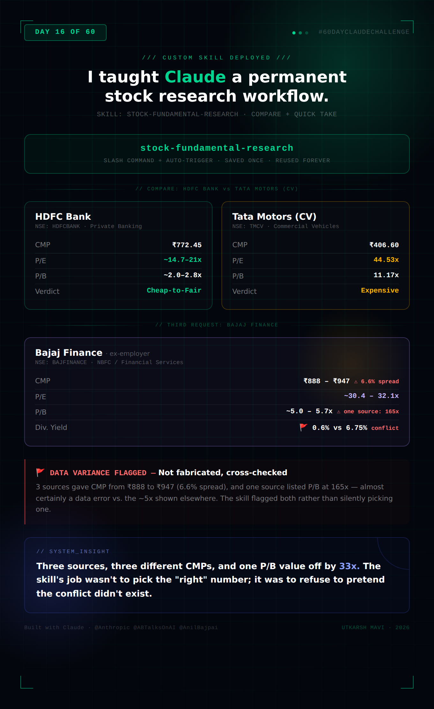

# Day 16 — Build Your First Stock Research Skill

**Challenge:** Create a reusable Custom Skill in Claude that turns a long, complex stock-research prompt into a permanent capability — saved once, triggered automatically or via slash command, reused indefinitely.

**Skill Created:** `stock-fundamental-research`
**Tested With:** HDFC Bank, Tata Motors (Compare), Bajaj Finance (Quick Take — former employer, data-variance case study)

---

## Skill Setup

Created via Settings → Skills → New Skill, with:

- **Skill Name:** `stock-fundamental-research`
- **Trigger:** Slash command + auto
- **Description:** Analyze Indian and global listed companies using fundamentals, financial statements, business quality, competitive advantages, valuation, risks, and growth prospects. Generate evidence-based research reports and investor-friendly summaries. Never provide direct buy, sell, or hold recommendations.
- **Instructions:** Full "Stock Fundamental Analyzer" framework — Modes (Quick Take / Deep Dive / Compare / Pros & Cons / Portfolio Fit), Mandatory Rules (live data sourcing, no fabrication, citation, no buy/sell/hold), Research Checklist, Interpretation Rules, and Output Formats.

Once saved, the skill appears in the Personal Skills list, toggled on, and is reusable across any future conversation without re-pasting the instructions.

---

## Test Run: Compare — HDFC Bank vs. Tata Motors

⚠️ **Data Confidence Note:** Tata Motors underwent a corporate demerger in late 2025, splitting into Tata Motors Passenger Vehicles (NSE: TMPV) and Tata Motors Commercial Vehicles (NSE: TMCV, now trading as "Tata Motors Ltd"). Figures below refer to the commercial vehicle entity (TMCV) as of mid-June 2026, cross-checked across Tickertape, Kotak Neo, and IndMoney.

| Metric | HDFC Bank (HDFCBANK) | Tata Motors — CV (TMCV) |
|---|---|---|
| CMP | ₹772.45 | ₹406.60 |
| Market Cap | ₹11,89,391 Cr (wide source variance — verify) | ₹1,49,724 Cr |
| Face Value | ₹1 | ₹2 |
| 52W High/Low | ₹1,020.50 / ₹726–812 (sources vary) | ₹509.00 / ₹306.30 |
| P/E | ~14.7–21.0x | 44.53x |
| P/B | ~2.0–2.8x | 11.17x |
| ROE | 🚩 Data unavailable — verify at Screener.in | 🚩 Data unavailable — verify at Screener.in |
| Dividend Yield | ~1.1% | ~1.10% (₹4/share declared May 2026) |
| Sector | Private Banking | Commercial Vehicles (Auto) |

### Where HDFC Bank Leads

- **Valuation discipline:** P/E of 14–21x is materially below Tata Motors CV's 44.5x — screens as **Cheap-to-Fair** vs. **Expensive** by the skill's interpretation rules
- **Conservative book multiple:** P/B of ~2.0–2.8x vs. 11.17x — though P/B means something different for a bank (regulated capital) vs. an industrial manufacturer
- **Business model stability:** Long-established, diversified, deposit-funded franchise vs. a recently-demerged, single-segment entity with limited standalone trading history
- **Data reliability:** More consistent, abundant historical data than the newly-independent TMCV listing

### Where Tata Motors (CV) Leads

- **Earnings momentum:** Net profit up 33.81% YoY in Q4 FY26, with a 154.33% QoQ jump — **Accelerating** growth, though the demerger may distort YoY comparisons
- **Operational volume growth:** May 2026 CV sales up 17% YoY, domestic sales up 19% YoY — concrete operational data independent of accounting restructuring
- **Dividend declared:** ₹4/share final dividend post-demerger, signaling early shareholder returns

### Neutral Investor-Style Summary

These two stocks sit in fundamentally different categories and a direct comparison has limited standalone value. HDFC Bank is a large, mature, heavily-tracked private bank trading at a valuation well below Tata Motors CV on a P/E basis. Tata Motors CV is a newly-independent listing showing strong recent operational momentum but trading at a premium multiple with a much shorter standalone track record. The valuation gap partly reflects the difference in maturity and data history between the two, not purely relative cheapness or expensiveness.

🚩 **Data unavailable:** ROE, ROCE, D/E, Interest Coverage, Current Ratio, Promoter Holding %, and FII/DII trends for both companies — verify at Screener.in.

---

## Test Run: Bajaj Finance — Quick Take

⚠️ **Data Confidence Note:** This is the largest data-variance case encountered in this test. Three sources, checked within a 3-day window (12–15 June 2026), gave materially different figures for the same stock.

**Company:** Bajaj Finance Ltd. (NSE: BAJFINANCE, BSE: 500034) — NBFC, subsidiary of Bajaj Finserv, headquartered in Pune. Incorporated 1987 by Rahul Bajaj. *Selected because it is the user's former employer (Data Scientist, Credit Risk Analytics, Apr 2023–Jun 2025).*

| Metric | Value | Source | Notes |
|---|---|---|---|
| CMP | ₹946.7–946.9 | Bajaj Broking, 15-Jun-26 | |
| CMP | ₹918.3 | IndMoney, 12-Jun-26 | |
| CMP | ₹888.1 | Kotak Neo, 12-Jun-26 | 🚩 **6.6% spread across 3 sources in 3 days** |
| Market Cap | ₹5,91,248 Cr / ₹5,71,729 Cr / ₹5,42,000 Cr | Bajaj Broking / IndMoney-Screener / Kotak Neo | Wide variance, consistent with CMP spread |
| P/E | 32.12 / 30.43 / 31.90 | Bajaj Broking / Kotak Neo / Business Standard | Relatively consistent (~30–32x) |
| P/B | 165.63 / 5.25 / 5.01 / 5.74 | Bajaj Broking / Kotak Neo / Screener / Business Standard | 🚩 **165.63 is almost certainly a data error** — off by roughly 33x from the other three sources, which cluster around 5.0–5.7x |
| 52W High/Low | ₹1,102.5 / ₹787.9 | Consistent across all sources | |
| Dividend Declared | ₹5.40/share, 29-Apr-2026 | IndMoney | |
| Dividend Yield | 6.75% (IndMoney) vs. ~0.6% (implied from ₹5.40 / ~₹900 CMP) | 🚩 **Conflict** | IndMoney's 6.75% figure does not reconcile with the declared per-share amount against the current price — flagged rather than used |
| Promoter Holding | 54.7% | Screener, as of Mar '26 | FII 19.2%, DII 17.3%, Public 8.7% (Kotak) |
| Revenue (TTM) | ₹81,982 Cr | Screener | Profit ₹19,332 Cr |
| Q4 FY26 Net Profit | ₹5,464.57 Cr, +21.99% YoY, +37.37% QoQ | IndMoney | Sharp quarter-on-quarter acceleration |
| Revenue Trend | Up for 20 consecutive quarters (₹6.74K Cr → ₹21.61K Cr), ~5.9% avg quarterly growth | IndMoney | **Steady-to-Accelerating** per skill's growth categories |
| Interest Coverage | "Low" (flagged by Screener directly) | Screener | 🚩 Flagged risk factor — exact ratio not retrieved in this search, verify at Screener.in |

### Fundamental Quality: Moderate (with high data-confidence caveats)

The underlying business shows genuinely strong operational trends — 20 consecutive quarters of revenue growth and a sharp Q4 FY26 profit acceleration (+37.37% QoQ) are difficult to dismiss. P/E in the 30–32x range is consistent across sources and, importantly, sits well *below* Bajaj Finance's own historical multiples (the stock has traded above 40x in past years) — by the skill's interpretation rules, this could screen as **Fair-to-Cheap relative to its own history**, even if it remains a premium multiple versus typical NBFC sector averages.

However, three issues prevent a higher-confidence read: (1) the CMP variance of 6.6% across sources within a 3-day window is unusually wide for a large-cap, heavily-tracked stock; (2) the P/B figure of 165.63x from one source is almost certainly an error and was excluded from the verdict rather than averaged in; (3) the dividend yield conflict (6.75% vs. an implied ~0.6%) suggests at least one source has a data quality issue on this specific field. Screener's own flag of "low interest coverage ratio" is a genuine risk factor worth independent verification.

**Data Confidence: Moderate** — core metrics (P/E, 52W range, revenue/profit trends, promoter holding) are consistent and reliable; CMP, market cap, P/B, and dividend yield require independent verification before use.

### Want the full Deep Dive?
*(Per the skill's Quick Take format — this Quick Take could be extended into a full Deep Dive with Snapshot/Valuation/Growth/Health/Returns/Peers/Ownership/View tabs on request.)*

---

## Visual Summary

---

## Key Learnings

**1. A skill is a prompt that stops being a prompt.** The 600+ word instruction block — modes, mandatory rules, research checklist, interpretation rules, output formats — gets pasted exactly once. Every future conversation automatically inherits the entire framework, including the cross-checking and anti-fabrication rules that made the Bajaj Finance analysis useful rather than misleading. The cost of complexity is paid once; the benefit compounds indefinitely.

**2. The skill's value showed up most clearly in the Bajaj Finance test.** Choosing a former employer wasn't just a sentimental pick — it turned into the most useful test of the three. Three sources, checked within a 3-day window, gave CMPs that differed by 6.6%, and one source listed a P/B ratio of 165.63x against a consistent ~5x from three other sources — a 33x discrepancy that is almost certainly a data error. The skill's job wasn't to pick the "right" number. It was to surface the conflict instead of silently averaging it away or picking whichever number came first.

**3. Real-world financial data is messier than any single source admits — even for large, heavily-tracked stocks.** Bajaj Finance is a Nifty 50 constituent with enormous trading volume and analyst coverage, yet basic figures like CMP and dividend yield varied significantly across reputable sources within days of each other. The skill's rule to cross-check important figures with at least 2 sources, and to flag wide variance rather than silently picking one number, turned what could have been a confidently-wrong report into a transparently-uncertain one.

**4. Corporate actions break naive data pipelines — and the skill's rules caught it.** Tata Motors' late-2025 demerger means "Tata Motors" now refers to a different legal entity than it did a year ago, with a much shorter trading history. A less careful analysis would have blended pre- and post-demerger figures into a misleading trend line. The skill's emphasis on flagging data confidence (High/Moderate/Low) and explaining context rather than presenting numbers in isolation directly addressed this.

**5. Reusability changes the cost-benefit calculation for prompt quality.** Writing a prompt this detailed for a single use would be overkill. Writing it once, as a skill, for unlimited future stock research makes the upfront investment in precise rules (interpretation thresholds, source priority, output formats per mode) obviously worth it. Skills shift the economics of prompt engineering from "good enough for this task" to "worth getting exactly right, once."
