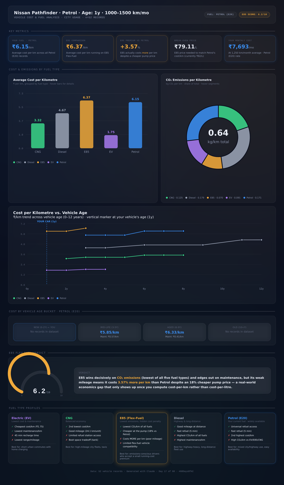

# Day 17 — AI Vehicle Cost & Fuel Analysis Dashboard

**Challenge:** Transform a raw CSV dataset of 52 vehicle fuel records into a complete, interactive HTML dashboard — no code written by hand, pure SVG charts, dark glassmorphism design — and use it to analyze real cost-per-km economics across fuel types.

**Vehicle:** Nissan Pathfinder · Petrol (E20) · City usage · 1,000–1,500 km/month · 0–2 years old

---

## Dashboard

The full interactive dashboard is also included as `vehicle-dashboard.html` — open it in any browser to hover over bars, donut segments, and line chart points for live tooltips.

---

## Key Metrics (Your Vehicle Profile)

| Metric | Value |
|---|---|
| Your fuel cost (Petrol E20) | ₹6.15/km |
| E85 cost for comparison | ₹6.37/km |
| E85 premium vs. Petrol | **+3.57%** (E85 costs more, not less) |
| E85 break-even price | ₹79.11/L (vs. actual price of ₹82/L) |
| Your estimated monthly cost | ₹7,693/month at 1,250 km/month |
| E85 Suitability Score | 6.2/10 |

---

## The E85 Paradox — Headline Finding

E85 (Flex-Fuel) is priced **18% cheaper per litre** than Petrol (₹82 vs. ₹100 per unit) — on the surface, an obvious switch. But E85 also has significantly worse mileage (12.87 km/unit vs. Petrol's 16.27 km/unit), and once that's factored in, **E85 actually costs 3.57% more per kilometre to drive** than Petrol.

This is the core insight the dashboard's cost-per-km calculation surfaces that a simple price-per-litre comparison would completely miss. The break-even calculation makes it concrete: E85 would need to be priced at ₹79.11/L (not its current ₹82/L) to actually match Petrol's running cost. At today's pricing, drivers switching to E85 purely for the "cheaper at the pump" signal are paying more, not less, for every kilometre they drive.

Where E85 does win decisively is emissions — at 0.070 kg CO₂/km, it's the lowest of all five fuel types in the dataset, even below Electric (EV) in this particular sample. That's a genuinely interesting and counterintuitive result worth flagging rather than smoothing over.

---

## Fuel Type Rankings (All 5 Types, 52 Records)

| Fuel | Cost/km | CO₂/km | Maintenance/km | Refuel Time | Mileage |
|---|---|---|---|---|---|
| Electric (EV) | ₹1.75 (lowest) | 0.091 kg | ₹0.23 (lowest) | 45 min (slowest) | 6.85 km/unit |
| CNG | ₹3.32 | 0.125 kg | ₹0.66 | 8 min | 24.11 km/unit |
| Diesel | ₹4.67 | 0.179 kg (highest) | ₹1.00 (highest) | 5 min | 19.58 km/unit |
| **Petrol (E20)** | **₹6.15** | 0.171 kg | ₹0.47 | 5 min | 16.27 km/unit |
| E85 (Flex-Fuel) | ₹6.37 (highest) | 0.070 kg (lowest) | ₹0.46 | 5 min | 12.87 km/unit |

**Notable pattern:** Electric and CNG dominate on running cost, but EV's 45-minute recharge time is a real practical tradeoff for anyone who can't charge at home. Diesel's advantage in mileage at distance is offset by the highest emissions and maintenance cost in the entire dataset — consistent with diesel's reputation for higher long-term upkeep.

---

## Cost vs. Vehicle Age

The age-trend analysis shows cost-per-km rising with vehicle age across every fuel type — expected, since maintenance costs typically climb as vehicles age. For Petrol specifically, the dataset only contains records starting at 3 years old, so the "New (0-2y)" bucket — which is where the Pathfinder currently sits — has no direct comparison data in this sample. The closest available reference point is the Mid-life bucket (3-5y) at ₹5.85/km, suggesting the Pathfinder's actual current cost is likely at or slightly below that figure given its newer status.

---

## Key Learnings

**1. Cost-per-litre and cost-per-km can point in completely opposite directions.** This is the single most important lesson from the dataset. E85's pump price made it look like the obvious economical choice, but the mileage penalty flips the conclusion entirely once you do the actual per-km math. Any fuel cost analysis that stops at the pump price is incomplete — and potentially misleading enough to cost real money over a year of driving.

**2. Visualizing the break-even point makes an abstract percentage concrete and actionable.** "E85 costs 3.57% more per km" is a fact. "E85 would need to drop to ₹79.11/L to break even" is a decision-making tool — it tells you exactly what price movement to watch for before E85 becomes worth switching to. Converting a percentage into a specific number people can track against real-world prices is what turns analysis into something useful.

**3. A dataset's gaps are themselves a finding.** The Pathfinder's "New (0-2y)" age bucket had zero matching Petrol records in this 52-row sample. Rather than hiding that gap or fabricating an estimate, the dashboard surfaces it directly ("No records in dataset") — which is more honest and more useful than a confident-looking number with no data behind it.

**4. SVG charts built from scratch force you to understand the data geometrically, not just statistically.** Calculating the exact arc paths for the donut chart, or the coordinate transforms for the line chart's vertical age marker, requires actually reasoning about what the numbers mean spatially — which surfaced details (like E85's emissions actually beating EV's in this sample) that might have been glossed over with an off-the-shelf charting library.

**5. The most surprising insight in a dataset often contradicts the most obvious marketing claim.** E85 (and ethanol blends generally) are frequently marketed on pump price alone. The data here shows that's an incomplete — and in this case, reversed — picture once mileage is factored in. Good data analysis isn't about confirming intuitive expectations; it's about finding exactly where the data disagrees with them.
