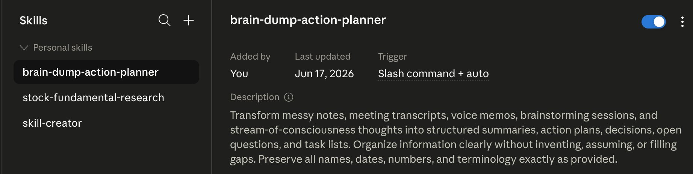
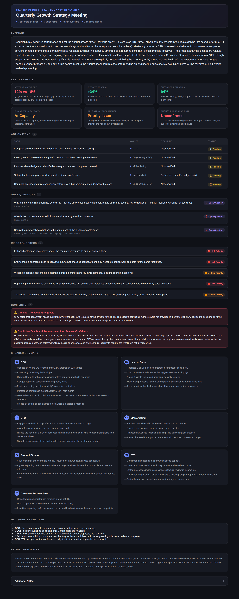

# Day 18 — Build a Brain Dump Action Planner Skill

**Challenge:** Create a reusable Custom Skill that turns messy notes, meeting transcripts, and brain dumps into structured, interactive HTML dashboards — without inventing, assuming, or filling in any gaps.

**Skill Created:** `brain-dump-action-planner`
**Tested With:** A real multi-speaker meeting transcript (Quarterly Growth Strategy Meeting) in Transcript Mode

---

## Skill Setup

Created via Settings → Skills → New Skill, with:

- **Skill Name:** `brain-dump-action-planner`
- **Trigger:** Slash command + auto
- **Description:** Transform messy notes, meeting transcripts, voice memos, brainstorming sessions, and stream-of-consciousness thoughts into structured summaries, action plans, decisions, open questions, and task lists. Organize information clearly without inventing, assuming, or filling gaps. Preserve all names, dates, numbers, and terminology exactly as provided.
- **Instructions:** Full output spec — required sections (Summary, Key Takeaways, Action Items, Open Questions, Risks/Blockers, Conflicts, Additional Notes), status badge system, Transcript Mode and Merge Mode rules, and the strict "never invent" constraint.

---

## Test Run: Quarterly Growth Strategy Meeting (Transcript Mode)

**Input:** A 7-speaker meeting transcript covering Q2 revenue performance, enterprise deal slippage, marketing conversion rates, engineering capacity constraints, customer support trends, hiring plans, and a customer conference budget decision.

**Output:** A complete interactive HTML dashboard (`brain-dump-dashboard.html`) with Summary, Key Takeaways, Action Items table, Open Questions, Risks/Blockers, Conflicts, full Speaker Summary, Decisions by Speaker, Attribution Notes, and a collapsible Additional Notes section.

---

## What the Skill Surfaced

**5 Action Items** — each with Task, Owner, Deadline, and Status. Three of the five had no specific deadline mentioned in the transcript, and the skill correctly marked these "Not specified" rather than inventing a plausible date.

**3 Open Questions** — including a partially-answered one (why deals slipped) which the skill noted as "partially answered" rather than treating it as fully closed, since the transcript didn't specify a resolution timeline.

**5 Risks/Blockers** — ranging from the annual revenue target risk to the specific tension between engineering capacity and competing project demands (the August dashboard vs. a potential website redesign).

**2 Conflicts**, surfaced without resolution, exactly per the skill's Transcript Mode rules:
1. **Headcount requests** — the CFO mentioned department heads submitted different headcount numbers, but the transcript never specified what those numbers were. The skill flagged the conflict's existence without inventing figures.
2. **Dashboard announcement vs. release confidence** — Head of Sales wanted to announce the dashboard at the conference; Product Director said only if confident about the date; CTO said he couldn't guarantee it. The CEO's resolution (avoid public commitments) doesn't fully resolve the underlying sales/marketing vs. engineering tension, and the skill noted that explicitly rather than treating the CEO's directive as a clean fix.

**7 Speaker Summaries** — one card per speaker (CEO, Head of Sales, CFO, VP Marketing, Product Director, CTO, Customer Success Lead), each listing only statements that speaker actually made.

**Attribution Notes** — the skill flagged that several action items (the cost estimate, the milestone review) were attributed to "CTO/Engineering" broadly rather than a named individual, since the transcript never names a specific engineer — and that the conference vendor-proposal task had no owner at all in the source material.

---

## Key Learnings

**1. "Never invent" is the hardest and most valuable constraint in this skill.** It would have been easy — and tempting — to assign plausible deadlines to the action items, or to guess at the conflicting headcount numbers the CFO mentioned but never stated. The skill's output is more useful precisely because it resists that temptation. A dashboard full of confident-looking fake deadlines would be actively harmful in a real work context; "Not specified" is the honest and correct answer.

**2. Transcript Mode's speaker attribution forces a level of precision that a generic summary skips.** Writing "the team discussed engineering capacity" loses information. Writing "CTO confirmed engineering is operating close to capacity" preserves who is accountable for that statement — which matters enormously in a real meeting follow-up, where "who said what" often becomes the basis for "who owns what."

**3. Conflicts and decisions are not the same thing, and conflating them loses critical information.** The CEO's directive to "avoid public commitments until the milestone review" is a decision. The underlying disagreement between sales wanting to announce and engineering being unable to confirm the timeline is a conflict that decision doesn't actually resolve. The skill's separate Conflicts section, with an explicit rule to never auto-resolve, captures a nuance that a flatter "action items" list would have buried.

**4. A reusable skill changes how you'd actually use this in practice.** The value isn't really demonstrated by one dashboard — it's that the next messy voice memo, the next chaotic brainstorming session, the next half-structured class notes file can go through the exact same rigorous treatment without re-explaining the rules each time. The 600+ word instruction set (required sections, badge system, mode-specific rules) only has to be "right" once.

**5. Designing for "feels like Notion/Linear/Asana" is itself a content discipline, not just a visual one.** Hitting that bar required structuring information the way those tools structure it — tables for tasks, badges for status, cards for scannable facts, collapsible sections for supporting detail — which in turn forced a cleaner separation of the transcript's content into the right buckets (a fact is a Takeaway; an unresolved tension is a Conflict; a pending task is an Action Item) rather than dumping everything into one long block of prose.
