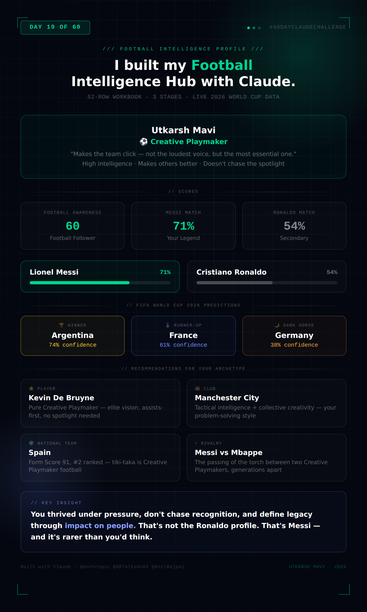

# Day 19 — Build a Football Intelligence Hub

**Challenge:** Upload a real football data workbook, run through a 3-stage AI-powered Football Intelligence Experience — World Cup 2026 predictions, Football IQ Quiz, and Messi vs Ronaldo Personality Match — and generate a personal Football Intelligence Profile.

**Data Source:** ABTalks WorldCup Intelligence Master workbook (52 rows, 7 tables including live 2026 World Cup group stage data as of June 17, 2026)
**Knowledge Level:** Casual follower (Option C)

---

## Football Intelligence Profile Card

---

## Stage 0 — Knowledge Level: Casual Follower

Selected: "I follow casually — I watch major tournaments like the World Cup."
Used to calibrate explanation depth and terminology throughout all three stages.

---

## Stage 1 — FIFA World Cup 2026 Prediction Report

### Most Likely Winner: Argentina — 74% Confidence

**Evidence:**
- FIFA Ranked #1, Form Score 92 (highest of all 8 contenders in the dataset)
- Historical win rate: 68% across 50 pre-tournament matches
- Best goals-for to goals-against ratio among contenders (98 for, 32 against)
- Live 2026 data: opened with a 3-0 win over Algeria (Group J, Jun 16)
- Messi rated 96 — highest player rating in the dataset, 20 goals, 12 assists

**Key risks:** Messi's age (38 during tournament), Austria also sitting on 3 pts in Group J

---

### Runner-Up: France — 61% Confidence

**Evidence:**
- FIFA Ranked #3, Form Score 90
- 2018 winners, 2022 runners-up — back-to-back finals presence
- Mbappe rated 95, 22 goals (highest of all tracked players)
- Won Group I opener 2-0 vs Senegal (Jun 16)

**Key risks:** Goals conceded in recent form (8) higher than Argentina (6) and Spain (5)

---

### Dark Horse: Germany — 38% Confidence

**Evidence:**
- Form Score 87 — outperforming their #9 FIFA ranking
- Most emphatic group stage result: 7-1 vs Curaçao (Jun 14)
- 22 goals in recent form — second only to Spain (24)
- 2014 World Cup winners; historically peak at tournaments

**Key risks:** Highest goals conceded among contenders (11 in recent form); 2018 group stage exit as defending champions shows vulnerability

---

### Players to Watch

| Player | Country | Goals | Assists | Rating |
|---|---|---|---|---|
| Lionel Messi | Argentina | 20 | 12 | 96 |
| Kylian Mbappe | France | 22 | 8 | 95 |
| Erling Haaland | Norway | 25 | 4 | 94 |
| Cristiano Ronaldo | Portugal | 18 | 5 | 94 |
| Jude Bellingham | England | 10 | 9 | 91 |

---

## Stage 2 — Football IQ Quiz

### Questions & Answers

| Q | Question | My Answer | Correct | Result |
|---|---|---|---|---|
| 1 | How many teams in 2026 World Cup? | C — 48 | C — 48 | ✅ |
| 2 | Who won the 2018 World Cup? | D — France | D — France | ✅ |
| 3 | Which teams share Form Score 88? | B — Portugal & Germany | C — Portugal & Brazil | ❌ |
| 4 | Highest goal scorer beats Messi+Mbappe+Ronaldo combined? | C — No single player | B — Haaland (25, highest individually but not combined) | ❌ |
| 5 | Most one-sided group stage result? | B — Germany 7-1 Curaçao | B — Germany 7-1 Curaçao | ✅ |

### Football Awareness Score: 60 / 100
### Classification: ⚽ Football Follower

**Strongest areas:** Tournament structure (knew the 48-team expansion), historical winners, live results
**Weakest areas:** Granular form score comparisons, precise player stat rankings
**Key gap:** Moving from event-level knowledge to data-level tracking — a habit, not a knowledge problem

---

## Stage 3 — Messi vs Ronaldo Personality Match

### My Answers

| Trait | Answer |
|---|---|
| Ambition | Ambitious but steady — build toward goals methodically |
| Discipline | Very structured — strict routine, rarely deviate |
| Under Pressure | Thrive — pressure brings out best performance |
| Teamwork | The creative one who makes others better |
| Failure | Analyze, learn, come back stronger — failure fuels me |
| Recognition | Somewhat important — appreciate it but don't chase it |
| Work Ethic | 5/5 |
| Problem Solving | Creative within structure |
| Competitiveness | 5/5 |
| Leadership | Strategize — plan carefully, everyone knows their role |
| Decision Making | Analyze every option carefully before committing |
| Legacy | The impact I had on the people around me |

### Compatibility Scores

| Legend | Score |
|---|---|
| 🐐 Lionel Messi | **71%** |
| 💪 Cristiano Ronaldo | **54%** |

**My Legend: Lionel Messi**

Key alignment points: makes others better rather than seeking solo glory, doesn't chase recognition, analyses setbacks rather than reacting emotionally, defines legacy through impact on people rather than personal acclaim. 5/5 work ethic overlaps with Ronaldo, but the *how* is Messi's — steady, structured, and understated rather than performative.

---

## Football Personality Archetype: Creative Playmaker

> *"The one who makes the team click — not the loudest voice, but the most essential one."*

**Key traits:** High intelligence, creative problem-solving within structure, elevates teammates, thrives under pressure without needing the spotlight, consistent work ethic, thoughtful decision-making, defines legacy through relationships rather than records.

### Recommendations

| Category | Recommendation | Why |
|---|---|---|
| Player | Kevin De Bruyne | Pure Creative Playmaker — elite vision, assists-first, no spotlight needed |
| Club | Manchester City | Tactical intelligence + collective creativity matches the archetype |
| National Team | Spain | Form Score 91, #2 ranked — tiki-taka is Creative Playmaker football by design |
| Rivalry | Messi vs Mbappe | Two Creative Playmakers, different generations — the passing of the torch |

---

## Key Learnings

**1. Structured multi-stage prompts create genuinely different experiences from simple Q&A.** The prompt's three-stage architecture (predictions → quiz → personality) meant each stage built on context from the previous one. By Stage 3, Claude already knew my knowledge level (casual follower) and was calibrating the personality assessment's explanation depth accordingly. That continuity is only possible when the prompt is designed to carry state across stages.

**2. Live data inside a static workbook is a powerful design pattern.** Table 7 contained actual 2026 World Cup group stage results as of June 17 — meaning the prediction report wasn't just based on historical trends but also on live tournament evidence (Argentina's 3-0 opener, Germany's 7-1 demolition). Embedding "as of [date]" data into the workbook keeps the analysis grounded in reality rather than operating purely on pre-tournament projections.

**3. Personality assessments work best when they never ask the obvious question directly.** None of the 12 personality questions mentioned Messi or Ronaldo. They asked about ambition, decision-making under pressure, legacy, and how you respond to failure. The mapping to the legends happened algorithmically after the fact — which produces a more honest result than asking "are you more Messi or Ronaldo?" directly and getting an aspirational answer.

**4. Confidence scores make predictions more honest, not less.** Argentina at 74%, France at 61%, Germany at 38% — these numbers force the analysis to acknowledge uncertainty rather than presenting a single "answer." A prediction with a confidence score tells you both what the data suggests AND how much to trust it. That's a fundamentally more useful output than a flat ranking.

**5. The personality result was genuinely surprising.** Going in, I would have expected more Ronaldo overlap given the 5/5 scores on both Work Ethic and Competitiveness. What I didn't account for was how much the Recognition, Legacy, and Teamwork questions pulled toward Messi. It's a reminder that two people can share extreme levels of drive and competitiveness and still operate in completely different ways — and those operational differences matter more than the shared intensity.
