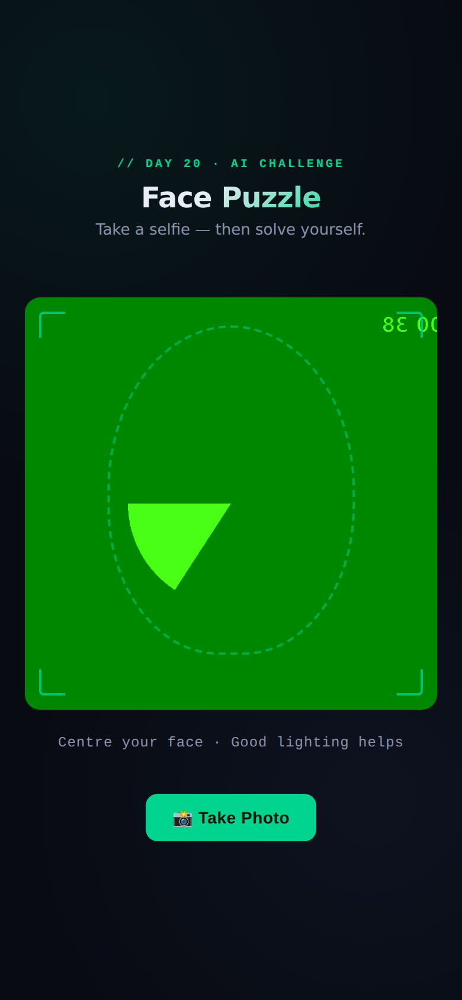

# Day 20 — Build an AI Face Puzzle Game

**Challenge:** Build a complete, fully working face puzzle game as a single self-contained HTML file — webcam capture, image slicing, drag-and-drop puzzle mechanics, timer, move counter, win detection, and localStorage leaderboard. No frameworks, no backend.

---

## The Game

**File:** `face-puzzle-game.html` — open in any browser (Chrome, Firefox, Safari). Works on localhost or HTTPS. Camera requires browser permission.

---

## Features Built

### Camera Access
- `getUserMedia()` with front-facing camera preference
- Live video preview with a face guide oval and corner bracket overlays
- Mirror effect (canvas flip) so the captured image matches what you see
- Graceful permission-denied error state with clear message

### Puzzle Generation
- Difficulty selection: 3×3 (9 pieces), 4×4 (16 pieces), 5×5 (25 pieces)
- Captured face image sliced into equal pieces using canvas `backgroundPosition` offsets
- Fisher-Yates shuffle with guaranteed-non-solved initial state (re-shuffles if identical to solved)
- Each piece positioned absolutely on the board at its scrambled grid cell

### Drag & Touch Controls
- Full mouse drag support (desktop)
- Touch drag support (mobile/tablet) with `passive: false` to prevent scroll hijack
- Drag: piece lifts with blue glow border and higher z-index
- Hover target: dashed amber border on the piece that will be swapped
- On release: pieces snap to grid cells; swap is executed if target is valid
- Correct position: permanent green border highlight

### Timer & Move Counter
- Live timer starts the moment the puzzle begins (mm:ss.t format, 100ms updates)
- Move counter increments on every valid swap
- Progress bar showing pieces correctly placed / total pieces

### Win Detection & Results
- Detects win when all pieces return to their correct indices
- Timer stops immediately; 0.3s delay then win overlay appears with pop-in animation
- Confetti burst (60 pieces, random colors and timings)
- Results overlay shows: final time, total moves, grid size
- Top 5 times saved to localStorage with date, time, moves, and grid
- Leaderboard table rendered on the win screen

### UI & Polish
- Dark navy background (#080b12) with subtle radial gradient orbs
- Gradient title text (white → green)
- Camera screen: face guide oval, corner bracket accents, monospace hint text
- Difficulty screen: visual grid icon previews for each size
- Game screen: stats chips row + animated progress bar + board
- Full responsive layout — works 375px to 1440px
- Retake Photo, Play Again, New Photo, Change Grid buttons on appropriate screens

---

## How to Play

1. Open `face-puzzle-game.html` in Chrome, Firefox, or Safari
2. Allow camera access when prompted
3. Centre your face in the oval guide and click **Take Photo**
4. Choose a difficulty: 3×3 (easy), 4×4 (medium), 5×5 (hard)
5. Click **Start Puzzle**
6. Drag and drop pieces to swap them into the correct positions
7. Green border = correct position; amber dashed border = swap target
8. Solve the puzzle to see your time, moves, and leaderboard

---

## Key Learnings

**1. `getUserMedia()` is genuinely straightforward once you handle the two failure modes.** Browser camera API has a clean promise interface — the complexity is almost entirely in handling permission denial (async rejection) and the mirror effect (canvas `scale(-1, 1)` before drawing). Everything else is just video → canvas → dataURL, which is a 10-line operation.

**2. Canvas image slicing is about `backgroundPosition`, not actual cutting.** The puzzle pieces aren't separate image files — they're all divs with the same full background image, but each has a different `backgroundSize` and `backgroundPosition` that shows only its slice. This is more efficient than using `getImageData` / `putImageData` and avoids any CORS issues with image data.

**3. Swap-based puzzles are categorically simpler than sliding puzzles.** The classic sliding puzzle requires sophisticated solvability checking (counting inversions + blank tile position) because not all permutations of a sliding puzzle are reachable. Swap-based puzzles — where any two pieces can trade places — mean any scrambled arrangement is reachable from any other, so solvability is trivially guaranteed. The only check needed is ensuring the shuffle doesn't produce the already-solved state.

**4. Touch event handling requires `passive: false` and careful event math.** The `touchmove` event needs `passive: false` to call `preventDefault()` and stop the page from scrolling during drag. The rest is the same as mouse events — just reading `e.touches[0].clientX` instead of `e.clientX`. Extracting the position into a shared `getClientPos()` function that handles both mouse and touch is the cleanest pattern.

**5. A single HTML file with all CSS and JS inline is both a constraint and a discipline.** No build tool, no module imports, no component framework — every dependency decision is visible immediately and has a direct performance cost. It forces deliberate choices about what actually needs to be there, and the result is a game that loads instantly with zero network requests after the initial HTML fetch.
