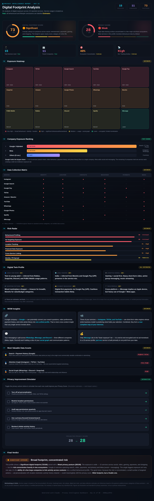

# Day 21 — Build a Digital Privacy Intelligence Dashboard

**Challenge:** Use Claude to analyze a digital ecosystem, estimate privacy exposure, identify tracking risks, and generate a premium interactive cybersecurity-style dashboard — strictly separating Facts (services used) from Estimates (inferred behaviour).

**Dataset (provided in prompt):** 15 services — Instagram, Snapchat, TikTok, YouTube, Discord, WhatsApp, iMessage, Spotify, Roblox, PUBG Mobile, Amazon, Meesho, Google Search, Google Pay, Google Photos

---

## The Dashboard

**File:** `privacy-dashboard.html` — open in any browser. Fully interactive (the Privacy Improvement Simulator updates the projected score live).

---

## Key Scores

| Metric | Score | Verdict |
|---|---|---|
| Digital Footprint Score | 73 / 100 | 🟠 Significant |
| Privacy Score | 28 / 100 | 🔴 Weak |
| Total Services (Fact) | 15 | — |
| Parent Companies (Fact) | 11 | — |
| Ecosystem Concentration (Estimate) | ~40% | Google-heavy |
| Estimated Tracking Surface (Estimate) | High | — |

---

## Company Exposure Ranking (Fact-Based)

| Rank | Company | Services | Which |
|---|---|---|---|
| 1 | Google / Alphabet | 4 | Search, YouTube, Pay, Photos |
| 2 | Meta | 2 | Instagram, WhatsApp |
| 3 | 9 other companies | 1 each | Snap, ByteDance, Discord, Apple, Spotify, Roblox, Tencent (PUBG), Amazon, Meesho |

The single most important finding: **Google alone holds 4 of the 15 services** — spanning search intent, video behaviour, payment history, and the entire photo library. That's the most cross-context insight any one company in this profile can assemble.

---

## Risk Radar (Estimates)

| Risk Dimension | Level |
|---|---|
| Behavioural Profiling | 90 — Critical |
| Ad Targeting Exposure | 88 — Critical |
| Cross-Service Linking | 78 — High |
| Location Tracking | 75 — High |
| Financial Data Exposure | 70 — High |
| Identity / PII Spread | 60 — Moderate |

---

## Digital Twin Profile (All Estimates)

Inferred *only* from the service list, with no claim of certainty or database access:
- **Likely age band:** Teen to young adult (Roblox, Snapchat, Discord, PUBG Mobile)
- **Likely region:** India (Meesho + Google Pay/UPI)
- **Lifestyle signal:** Gaming + social-first, heavy short-form video
- **Shopping pattern:** Mixed marketplace (Amazon for breadth, Meesho for value)
- **Payment behaviour:** Digital-first / cashless (UPI)
- **Tech profile:** Cross-platform (iMessage implies Apple device + heavy Google/Meta apps)

---

## Most Valuable Data Assets (Estimates)

1. 🥇 **Search + Payment History (Google)** — intent data paired with transaction data is the most commercially valuable combination in advertising
2. 🥈 **Attention Graph (Instagram + TikTok + YouTube)** — a precise model of what content holds attention and for how long
3. 🥉 **Social Graph (WhatsApp + Discord + Snapchat)** — who you talk to, how often, in what groups

---

## Privacy Improvement Simulator (Interactive)

The dashboard includes a live simulator. Toggling all five recommended actions raises the projected privacy score from 28 toward the 60s:
- Turn off ad personalization (+9)
- Restrict location permissions (+8)
- Audit app permissions quarterly (+7)
- Use a privacy-focused browser/search (+6)
- Review & delete activity history (+5)

---

## Final Verdict

**🟠 Significant Exposure — broad footprint, concentrated risk.** Wide presence (15 services across social, video, gaming, payments, shopping) with a weak privacy posture, but the risk concentrates heavily in two ecosystems (Google and Meta). Because the risk is concentrated rather than scattered, a small number of targeted actions can meaningfully shift the privacy score. Wide footprint — but a fixable one.

---

## Key Learnings

**1. The Fact/Estimate separation is the entire integrity of this exercise.** The prompt's strict rule — services used are Facts, everything inferred is an Estimate — is what separates a responsible privacy tool from fear-mongering. Every score, heatmap level, and digital-twin trait in the dashboard is explicitly labelled as an estimate based on general service categories, never as a verified fact about a real person. Building this way forces honesty about what AI can and cannot actually know.

**2. The biggest privacy risk isn't any single app — it's cross-context linking.** The most striking insight from the analysis wasn't that any one service collects a lot. It's that a single parent company (Google, with 4 services) can potentially link search intent, video preferences, payment history, and photos into one unified profile. The risk lives in the *concentration*, not the individual apps — which completely reframes how to think about privacy.

**3. Concentration cuts both ways — it's also what makes the problem fixable.** Because exposure concentrates in a few ecosystems, a small number of targeted actions (adjusting Google and Meta privacy settings, restricting location) disproportionately improves the picture. A scattered risk across 15 unrelated companies would be far harder to address. The simulator makes this tangible by showing the score climb with each toggle.

**4. A premium dashboard aesthetic builds trust in sensitive analysis.** For a privacy report specifically, the Stripe/Linear-inspired design isn't just decoration — it signals seriousness and care. A cluttered or alarmist design would undermine the measured, estimate-aware tone the content requires. The visual language (clean gauges, fact/estimate tags, methodical sectioning) reinforces the analytical credibility.

**5. Inference from minimal input is powerful — and exactly why labelling it matters.** From just 15 app names, the model can estimate age band, region, lifestyle, shopping habits, and payment behaviour with reasonable plausibility. That's genuinely impressive and genuinely concerning at the same time — which is the whole point of the exercise. Seeing how much can be inferred from so little is the strongest possible argument for treating those inferences as estimates and for taking privacy hygiene seriously.
