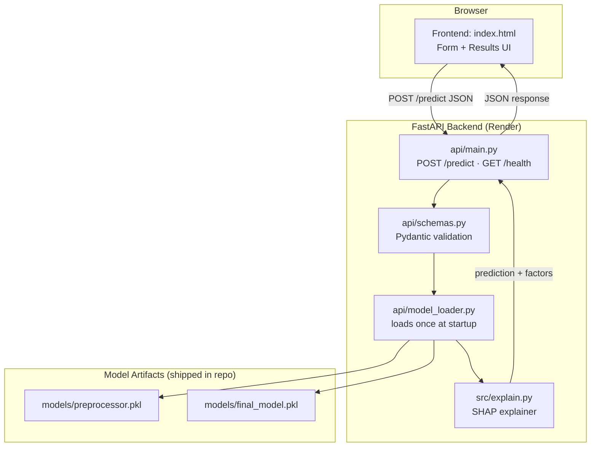
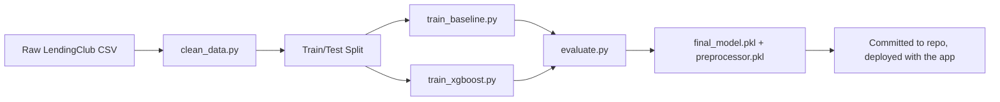
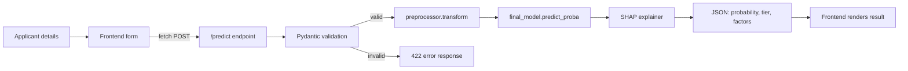
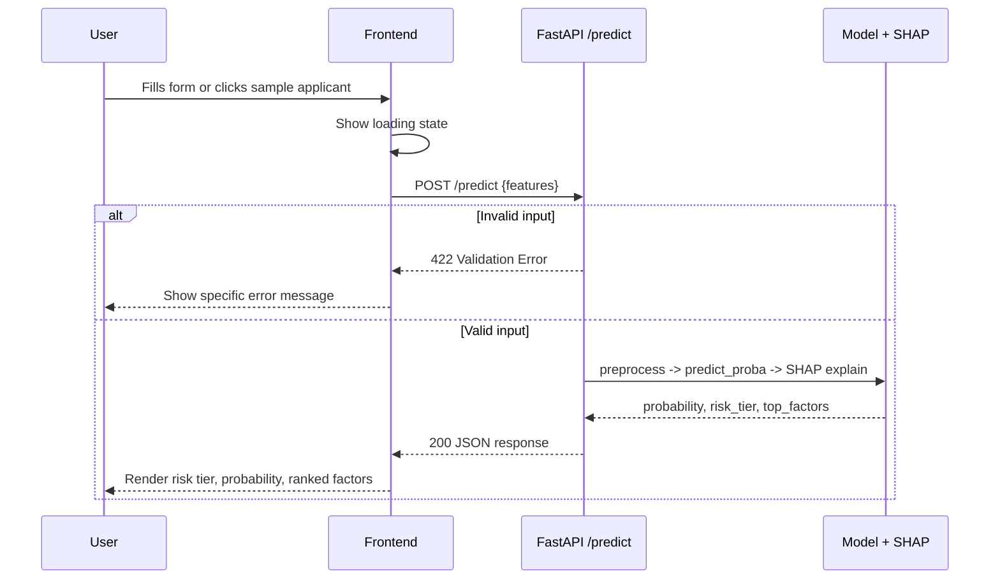

# RiskLens — System Architecture

**Capstone Day 2.** Source of truth: Day 1 PRD + Implementation Blueprint. This document does not redesign the project — it makes the approved plan concrete and diagrammed.

## Tech Stack (Finalized & Approved)

| Layer | Choice | Why |
|---|---|---|
| Frontend | Single self-contained HTML/CSS/JS file | Matches the PRD's single-form UI exactly; zero build tooling; consistent with the 51 single-file apps already shipped this challenge |
| Backend | FastAPI + Uvicorn | Async-native, auto-generated `/docs` for manual testing, Pydantic gives free request validation |
| Database | **None in v1.0** | The app is a stateless prediction API — no user accounts, history, or batch storage in scope (PRD §5.2). Validated against every PRD user story in `SCHEMA.md`. |
| Authentication | **None in v1.0** | Explicitly excluded in PRD §5.2 |
| ML Model | scikit-learn (Logistic Regression) + XGBoost, self-trained | A real trained classifier, not an LLM wrapper — this is the actual portfolio signal |
| Explainability | SHAP | Locked in Day 1 as a non-negotiable core feature |
| Model serialization | joblib | Standard for scikit-learn/XGBoost artifacts; loaded once at API startup |
| Hosting | Render.com (free tier) | Native FastAPI support, deploys from GitHub push; frontend served as a static file from the same app to avoid CORS entirely |
| Other tools | Git/GitHub, Python venv, Kaggle (manual download) | Nothing paid, nothing new to the existing workflow |

**Important framing:** RiskLens calls **zero external services at runtime**. No Claude API, no third-party API. The trained model runs on the same server as the API. Kaggle and GitHub/Render are development-time and deploy-time only.

## Component Diagram

## Data Flow — Two Distinct Flows

**Offline, one-time (Days 3-6, runs locally, never on the server):**

**Online, every request (Day 7 onward, runs on Render):**

## Request Lifecycle

## AI Interaction

There is no live AI/LLM call in this application. "AI" here refers to the trained ML model (Logistic Regression / XGBoost) making a prediction, and SHAP computing an explanation for that prediction — both run as local Python code within the FastAPI process, not as calls to an external AI API.

## External Services

| Service | When used | Runtime dependency? |
|---|---|---|
| Kaggle | Once, during Day 3 data download | No — data becomes local files |
| GitHub | Every `git push`, and Render's deploy trigger | No — deploy-time only |
| Render.com | Hosting the live app | Yes — this *is* the runtime, not an external call from it |

## Day 3 Readiness Check

- The remaining Blueprint (Days 3-10) is realistic at ~30-45 min/day, with one adjustment: data exploration (originally slated for "Day 2") is merged into Day 3 alongside environment/pipeline setup, since both are lightweight and naturally sequential. Day 10 deployment date is unaffected.
- No unnecessary scope has crept in during system design: database and auth were both confirmed **excluded**, matching the PRD, not added back "since we're doing architecture anyway."
- The API surface is deliberately 2 endpoints (`/predict`, `/health`) — matching the PRD's single-applicant-only scope exactly.
- Day 3 can begin implementation immediately using the updated Blueprint.
