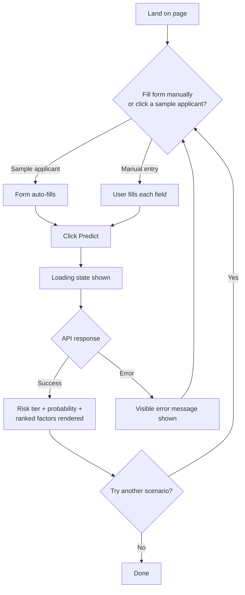

# RiskLens — UI & User Flow

## User Flow Diagram



## Screen Flow

RiskLens v1.0 is intentionally a **single screen** — this is a deliberate outcome of the PRD's single-applicant-scoring scope, not a missing feature. There is exactly one page with four possible *states*, not four separate screens:

| State | Trigger | What's shown |
|---|---|---|
| Initial | Page load | Empty/default form, no results panel, sample applicant buttons visible |
| Loading | Form submitted | Form disabled, a loading indicator where the results panel will appear |
| Result | API responds 200 | Risk tier badge, probability, ranked SHAP factors — form remains editable for resubmission |
| Error | API responds non-200, or network failure | A specific, visible error banner — form remains editable, nothing silently fails |

## Low-Fidelity Wireframe (single page, all states shown as one annotated layout)

```
+--------------------------------------------------------------------+
|  RiskLens                                    [About this tool ⓘ]   |
|  Explainable Loan Default Predictor                                |
+--------------------------------------------------------------------+
|                                                                      |
|  Try a sample applicant:                                           |
|  [ Low Risk ]   [ Medium Risk ]   [ High Risk ]                    |
|                                                                      |
+--------------------------------------------------------------------+
|  APPLICANT DETAILS                                                  |
|  ------------------------------------------------------------------ |
|  Loan Amount        [______]      Term          [ 36 mo v]         |
|  Interest Rate      [______]      Grade         [  B    v]         |
|  Annual Income      [______]      DTI           [______]           |
|  Employment (yrs)   [______]      Home Ownership[MORTGAGE v]       |
|  Purpose            [debt_consolidation      v]                    |
|  Credit History (yrs)[______]     Open Accounts [______]           |
|  Total Credit Lines [______]      Revolving Util%[______]          |
|  Delinquencies (2yr)[______]      Public Records [______]          |
|  Verification       [ Source Verified   v]                         |
|                                                                      |
|                    [        Predict Risk        ]                  |
+--------------------------------------------------------------------+
|  RESULTS  (hidden until first prediction; loading spinner here     |
|            while waiting; error banner here on failure)            |
|  ------------------------------------------------------------------ |
|   Risk Tier:  [ MEDIUM ]        Default Probability:  14%          |
|                                                                      |
|   Why this score:                                                   |
|   ↑ Revolving utilization (42%) increased risk                     |
|   ↓ Low DTI (18.4%) decreased risk                                 |
|   ↓ 6 years employment history decreased risk                      |
+--------------------------------------------------------------------+
```

## Navigation

**There is no navigation** — no menu, no routing, no second page. This is a deliberate design outcome: every screen exists for a reason (per today's design brief), and a single-purpose tool with one job doesn't need a second screen to justify. If Future Scope items (batch scoring, portfolio dashboard) are ever built, that would be the point navigation becomes necessary — not before.
